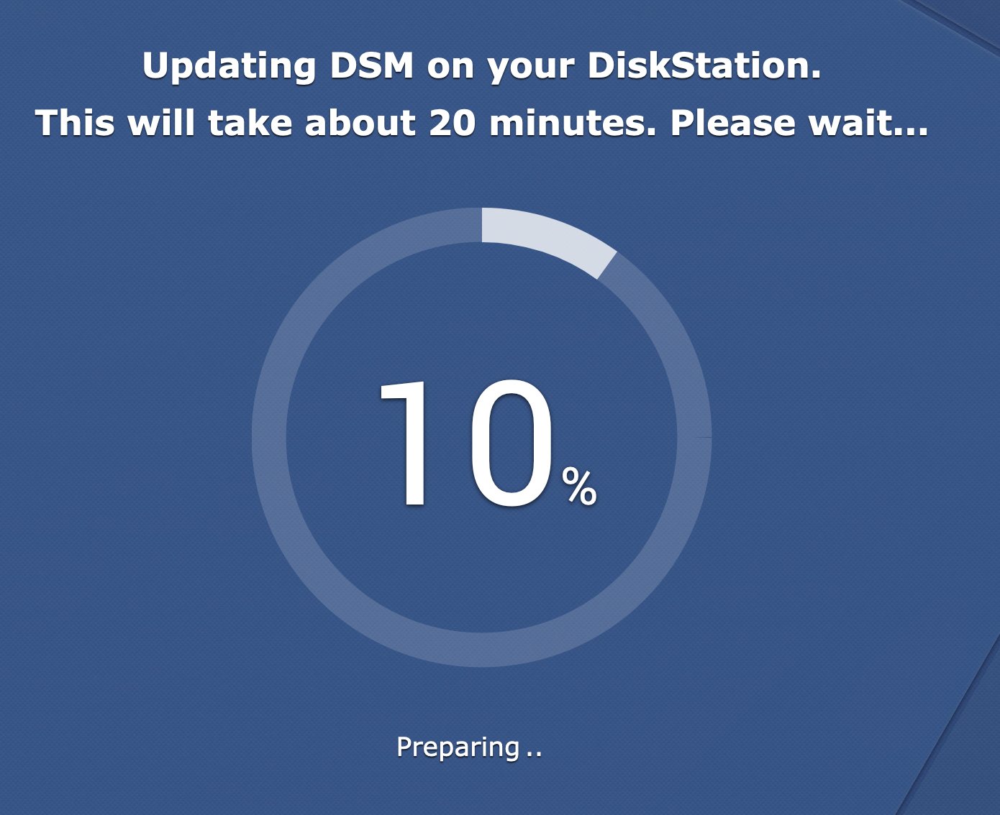
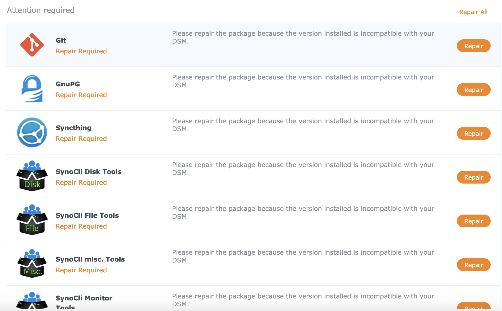
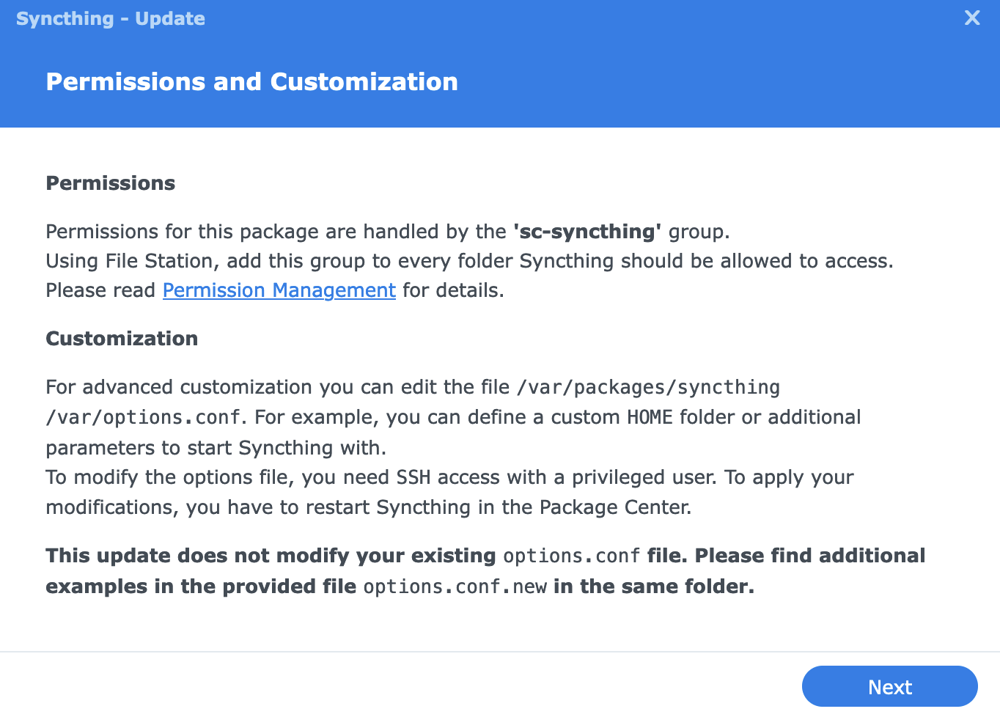
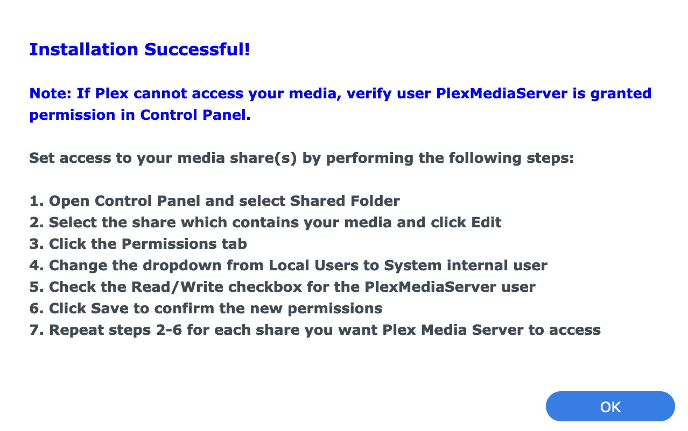
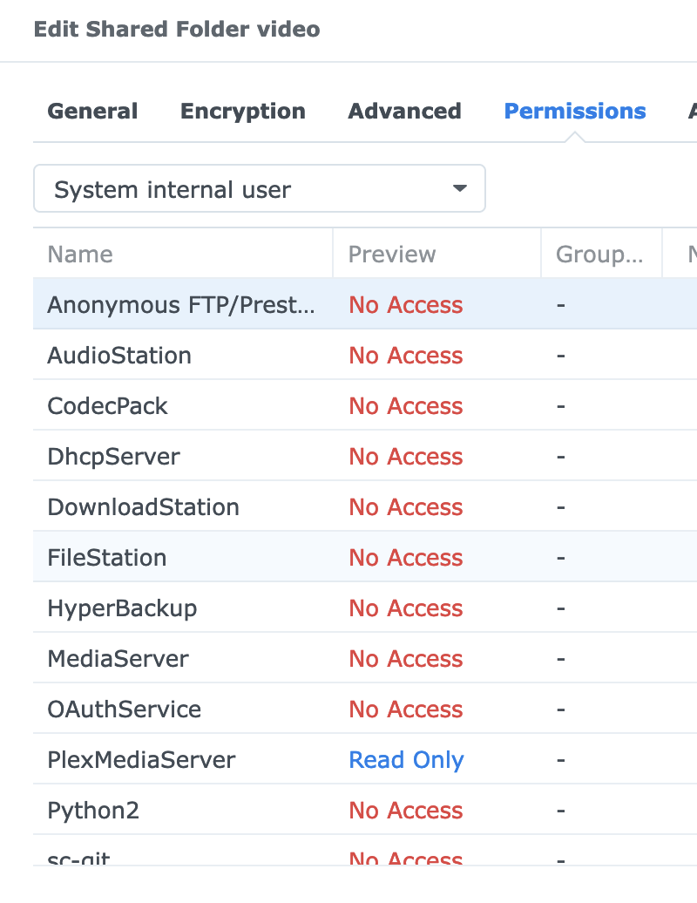

## Lets get the party started

What better way to celebrate the New Year than a major update of the server OS on your [home server](https://p.disfinder.com/2019/12/nas.html)?
<!--more-->
I'm generally not a big fan of major updates, especially when it comes to system components — the principle being "if it ain't broke, don't fix it", because I don't work with the system itself, I work with the apps — those are fine to update.

But when [the manufacturer announces end of support](https://www.synology.com/en-global/products/status/eol-dsm62), you'll have to update sooner or later.
And then another rule kicks in — better to update earlier, while articles on how to fix various migration issues from one major release to another haven't gone stale yet, and before the version gap grows so large that no one has even tested an upgrade from 6.2 to 49.155.

So if it has to be done, why not do it now? Since this Linux isn't a "real" one, we hit the "Update" button...
{}

{}

## ... and we've arrived

Almost every package I had installed shows up as "Needs Repair".
Much worse — clicking that button doesn't repair anything; it downloads the package and then reports that the downloaded package is invalid! Blimey, I was so startled I forgot to take a screenshot.


## Updating the updated

The freshly installed new major version shows that there's an even newer minor version available. Couldn't it just install the latest one right away? Apparently not. Well, at least it's something. Another 20 minutes of internal magic — and now the `Repair` button works.
{}


{}

## Checking the photos

One of the breaking changes in this update was the replacement of the Moments component (or whatever you call these internal Synology products) with Photos.
I was using Moments [as a backup for photos from my phones](/en/docs/articles/backup/) — an app on the phone that periodically uploads photos to the NAS.
The replacement was mentioned in the release notes, and overall the migration went smoothly. The old app on the phone now says "I won't work, press the button to install the new one" and links to the Play Store/App Store, old photos were transferred and new ones are being added.
Phew, the biggest headache is behind us.
(oh, only now I realized I didn't back up the photos before updating)
((oh dear, and now I also need to rework the photo backup setup, since it exists...))

## Unexpected problem one

(the heading implies there will be at least a "two")
{}

{}

`Syncthing` is complaining about several (but not all) missing folders, and permissions have nothing to do with it.
Turns out — the system update wiped all the extra folders (actually symlinks) like `/mnt/video` that I had created.
This isn't the first time (something like this happened when [the home server broke down](https://p.disfinder.com/2021/02/blog-post_22.html))
It's a good thing I have a handy Ansible playbook for configuring the server:

```shell
$ ./playbook-boxtree.yml --tags update_symlinks

TASK [Update symlinks] ********************************************************************************************************************************************************************
changed: [boxtree] => (item={'src': '/volume4/video', 'dest': '/mnt/video'})
changed: [boxtree] => (item={'src': '/volume1/Music', 'dest': '/mnt/music'})
changed: [boxtree] => (item={'src': '/volume4/backups3', 'dest': '/mnt/backups3'})
changed: [boxtree] => (item={'src': '/volume1/opt', 'dest': '/mnt/opt'})
```

## Unexpected problem two

The Plex server somehow ~~vanished~~ disappeared, but a new one appeared in its place.
Now clients show one server `offline` with all its folders inaccessible,
and a second one — with the same name — online and empty.

{}

{}

Somewhat annoying that I'll have to spend time sorting it out, but on the other hand — I've been looking for an opportunity to reorganize my video collections a bit, so for now I'll add some fresh content and deal with the old libraries later.

### Surprise — can't see folders

However, adding folders to the libraries of the "new" (actually the only) Plex server doesn't work: the web UI for adding content can't see the contents of the folders.

Turns out, these guys changed the username that the server runs under in the updated version (`plex` -> `PlexMediaServer`) — so the media server has no access to the files.



How convenient that I had the foresight to create a `video` group at some point, set up all the necessary permissions for it, and added the `plex` user to it — now I just need to add one more user and that's it!
Oh, but here's a lovely greeting from the Synology developers, dear user: 🖕 — in the new version, system users cannot be added to non-system groups! What the heck?

You can manually go into each required folder — there's an option to switch to "System Internal user" and grant access to the needed user.



Good thing I only have one folder for now.
I'll think about whether it's worth extending the Ansible playbook — I think that there (or in the console) I could put the user where it needs to go, though I'm a bit unsure whether that might backfire somehow.

Such is the proprietary price of convenience...
