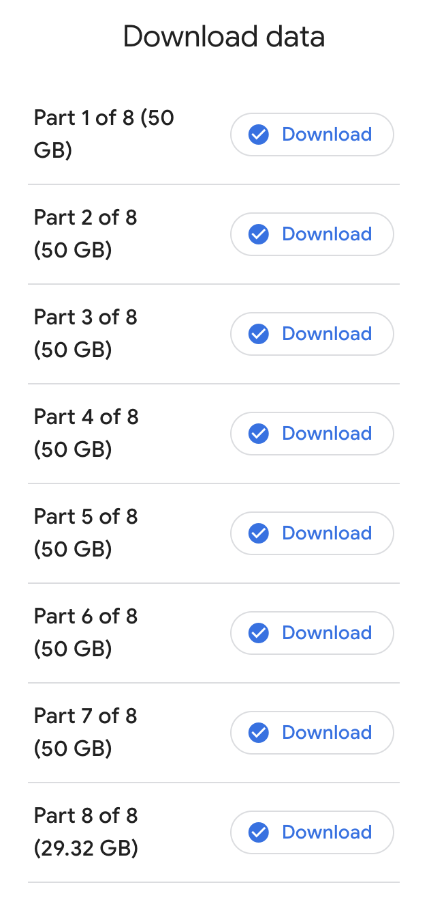
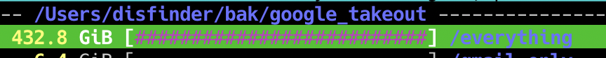

## Okay, Google, hand over what you've got

Decided to [grab the data](https://takeout.google.com/) Google has collected about me.
7×50GB + 30GB, that's quite a lot...
<!--more-->


When creating a takeout request, Google lets you choose the archive type and size — zip/tgz, ranging from 2 to 50 GB. I went with the largest ones, since I didn't want to deal with hundreds of small archives, and that turned out to be the right call.

Oh, and my very first takeout request actually failed — Google sent an email saying "sorry, couldn't do it" — the details showed it couldn't export data from Nest. Not sure why, whether it's related to the thermostat in my previous apartment being inaccessible or just a glitch. But when creating the next request I simply left Nest unchecked, and the archive was generated fine — 56 products ([services Google hasn't killed yet](https://killedbygoogle.com/)) instead of 57.

## Okay, user — take it if you can!

Google spent about a week or so (I didn't time it exactly) archiving all that data, then sent me a notification that it was ready.
Downloading via wget obviously didn't work — you'd need to authenticate wget somehow, no dice. I downloaded manually through the browser, re-downloading the files that failed several times.

Downloaded. 432 GB...


When I thought 2TB on a laptop was two (if not four) times more than I'd ever need, I wasn't expecting that compressed backups of my Google data would eat up a quarter of my free space.
In a moment of poor judgment I tried to unpack it all, but quickly realized the unpacked volume would be much larger and there simply wouldn't be enough free space — everything is already devoured by Docker and who knows what else (wait, what exactly?).

## Now three days of uploading this to the server

```shell
$ /opt/homebrew/Cellar/rsync/3.2.7_1/bin/rsync --rsync-path=/bin/rsync  -r -v --progress -e ssh ./ ansible@10.10.10.10:/volume1/backup/google_takeout/disfinder.gmail.com/2023-12-25-all
sending incremental file list
takeout-20231221T191146Z-001.tgz
 53,687,107,361 100%   43.35MB/s    0:19:41 (xfr#1, to-chk=7/9)
takeout-20231221T191146Z-002.tgz
 53,687,109,371 100%  195.24MB/s    0:04:22 (xfr#2, to-chk=6/9)
takeout-20231221T191146Z-003.tgz
 53,687,107,296 100%    4.40MB/s    3:14:02 (xfr#3, to-chk=5/9)
takeout-20231221T191146Z-004.tgz
 53,687,104,226 100%   28.09MB/s    0:30:22 (xfr#4, to-chk=4/9)
takeout-20231221T191146Z-005.tgz
  7,589,330,944  14%   22.34MB/s    0:33:35
```

So a full week had passed and I still hadn't seen what was actually inside those archives. Running `tar -tvf...` is an option of course, but you want to see the full picture.
Hopefully the server will have enough space for the unpacked stuff, and I won't be surprised if I have to unpack things twice to a different location — the encrypted volume doesn't like long filenames, and whether Google loves them and stuffs them into its takeout, I don't know yet.

2023-12-30: copy completed
```text
sent 299,997,238,931 bytes  received 6,560,187 bytes  13,301,283.52 bytes/sec
total size is 407,294,955,301  speedup is 1.36
```

Compared md5 hashes — they match.

## Unpacking

```text
real 223m44.980s
user 56m50.523s
sys 148m21.597s
```

Unpacked pretty fast.

The most space was taken by Google Photos — no surprise there — followed by the YouTube folder with my own uploaded videos, then Google Drive, and finally mail.
Here's what the unpacked folder looks like in `ncdu`:

```txt
--- Takeout --------
                                         /..
  316.7 GiB [##########################] /Google Photos
   42.8 GiB [###                       ] /YouTube and YouTube Music
   15.5 GiB [#                         ] /Drive
   13.1 GiB [#                         ] /Mail
    1.4 GiB [                          ] /Google Chat
  835.6 MiB [                          ] /Location History (Timeline)
  647.4 MiB [                          ] /Blogger
  230.2 MiB [                          ] /My Activity
  183.5 MiB [                          ] /Maps
   85.3 MiB [                          ] /Keep
   59.8 MiB [                          ] /Access Log Activity
   29.0 MiB [                          ]  archive_browser.html
   13.5 MiB [                          ] /Fit
   13.3 MiB [                          ] /Contacts
   10.9 MiB [                          ] /Voice
    4.6 MiB [                          ] /Chrome
    2.8 MiB [                          ] /Street View
  588.0 KiB [                          ] /Google Play Store
  412.0 KiB [                          ] /Recorder
  412.0 KiB [                          ] /Google Pay
  408.0 KiB [                          ] /Saved
  364.0 KiB [                          ] /Calendar
  224.0 KiB [                          ] /Groups
  184.0 KiB [                          ] /Reminders
  184.0 KiB [                          ] /Android Device Configuration Service
  152.0 KiB [                          ] /Google Account
  104.0 KiB [                          ] /Google Shopping
  100.0 KiB [                          ] /Home App
   84.0 KiB [                          ] /My Maps
   64.0 KiB [                          ] /Maps (your places)
   60.0 KiB [                          ] /Google Play Movies _ TV
   52.0 KiB [                          ] /Profile
   48.0 KiB [                          ] /Google Play Books
   40.0 KiB [                          ] /News
   36.0 KiB [                          ] /Tasks
   36.0 KiB [                          ] /Discover
   24.0 KiB [                          ] /Google Business Profile
   24.0 KiB [                          ] /Shopping Lists
   12.0 KiB [                          ] /Google Podcasts
   12.0 KiB [                          ] /Google Workspace Marketplace
   12.0 KiB [                          ] /Assistant Notes and Lists
   12.0 KiB [                          ] /Google Finance
   12.0 KiB [                          ] /Assignments
   12.0 KiB [                          ] /Search Contributions
   12.0 KiB [                          ] /Google Help Communities
```

## Exploration

### Google Photos

Photos are organized into album folders and additionally into year-based folders.
What's annoying is that duplicates are present — even though in the cloud, adding a file to a new folder doesn't create a copy, the download process doubled them up:

```txt
$ find . -type f -size +500M
./folder1/PXL_20220915_013956479.mp4
./folder2/PXL_20220915_013956479.mp4
...
```

Finding time to sort and fix this is unlikely, but those videos would be the top candidates to delete from Google Cloud — they take up too much space, and who ever watches them anyway?...

### Gmail

One huge single file at 13 gigs. Well... Not surprising, considering all the attachments are encoded inside (base64-encoded?). But now it's finally possible to clean out the old junk from the mailbox.

```txt
/Takeout/Mail --------------------------------
   13.1 GiB [##########################]  All mail Including Spam and Trash.mbox
   40.0 KiB [                          ] /User Settings
```

### Google Drive

At least no surprises here — files and folders, just like the web interface. I didn't check for duplicates, but I don't think there are any. And the sizes aren't anything to worry about.

## Outro

This takeout was initiated while writing an [article about backups](/en/docs/articles/backup/) and provided some food for thought and material to work with.
I started writing this post on December 28, 2023, and finished it on January 15, 2024 — and there's still more that could be added, but the steam has run out for now.
At the very least, it's now clear what Google has and where it lives — and more importantly, what can be deleted.
Stay tuned.
