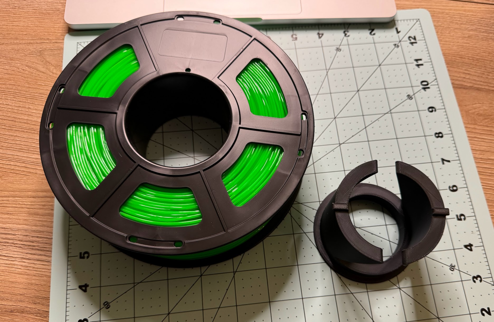

The everyday life of a 3D printer owner: a spool of filament was delivered, but it (inner diameter) doesn't fit the filament feed system of the printer.
<!--more-->
But hey, this is 3D printing! Good people before me have already stepped on this rake — and made an adapter, the model of which they happily shared with the world and the community.

But it turns out that before you can print something you actually need, you first have to print something you don't need.
The joke about "if it weren't for the car, I wouldn't have had time today to change the tires, replace the battery, drive to the gas station, and stop by the auto shop!" has somehow stopped being funny...

PS: and all of this just to find out (or rather, to remember) that the filament feed system doesn't support this particular filament (TPU), so it has to be printed from an external holder, which doesn't care about the diameter — meaning I could have saved myself the trouble with the adapter entirely...
