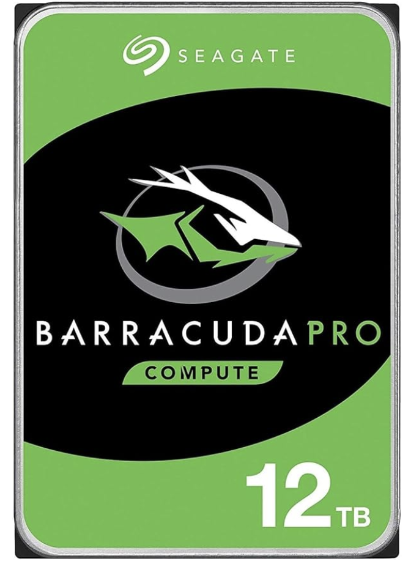
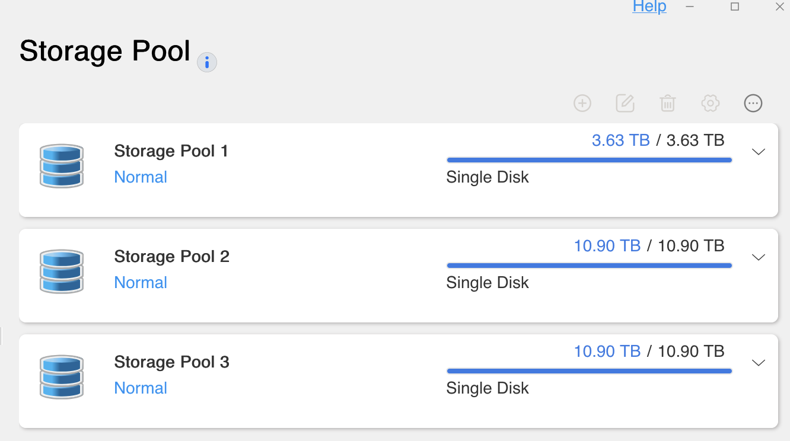

The drives I ordered for the new NAS were a bit of a surprise choice.
<!--more-->
I decided to take a risk and save some money at the same time, so I went with these:

```txt
Seagate BarraCuda Pro 12TB
Internal Hard Drive Performance HDD –
3.5 Inch SATA 6 Gb/s 7200 RPM 256MB Cache
for Computer Desktop PC Laptop –
Frustration Free Packaging (ST12000DM0007)
(Renewed)
```

 

On one hand: not expensive (relatively) — $100 for a 12TB drive is twice as cheap as new.
On the other hand — I hope both of them don't die at the same time.
On the third hand — well, what's the point of buying drives at half the price and sticking them in a mirror? No, they'll be separate — but I'll dump non-critical stuff on them.

Buckle up, here we go.


