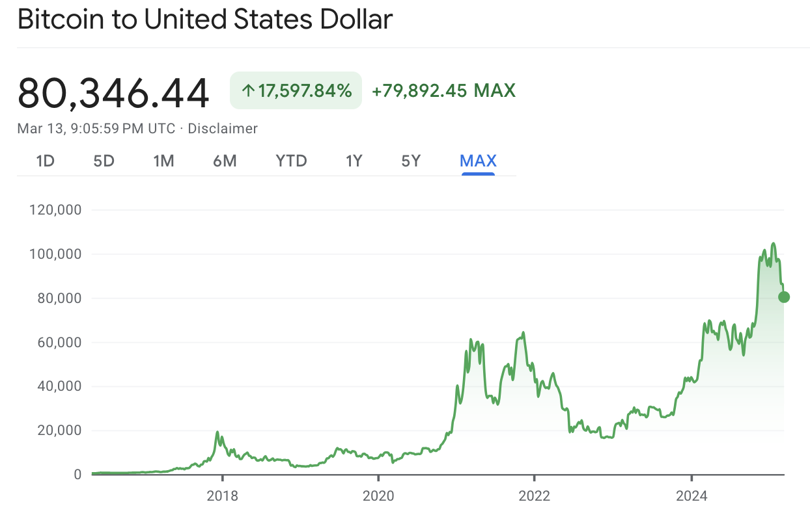
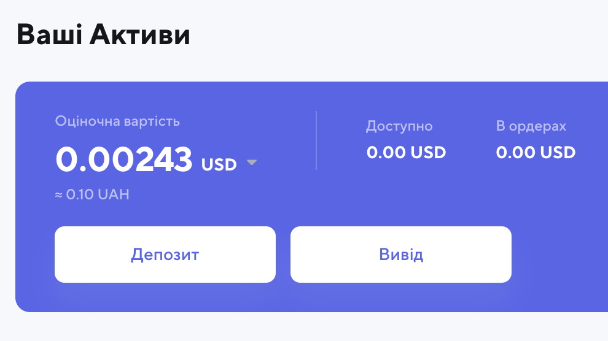
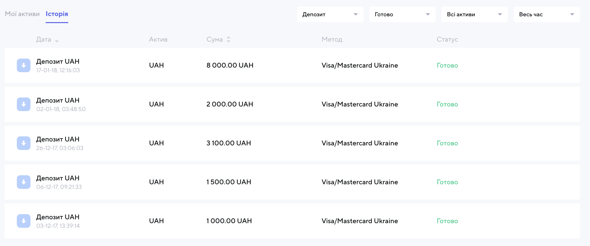
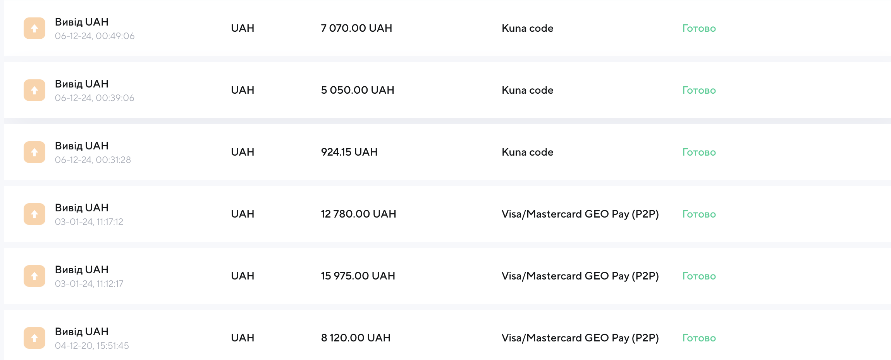

Today the Ukrainian crypto exchange `kuna.io` sent an email saying they're done.
<!--more-->
Just like that, they're shutting the exchange down. Trading is stopped, only withdrawals to your own wallets are available.
A beautifully written letter about how they had fulfilled their purpose and it was time to clear away the old to make room for the new — well, these things happen.
Luckily I didn't have much there to begin with — some time ago they cancelled operations via bank cards (the regulator stepped in, I assume), so I got nervous, scraped together and withdrew all my hryvnia balances. What remained was loose change, somewhere under twenty dollars, which today went to a crypto wallet belonging to PZh — since I still don't have one of my own :)

## Experience

In total I deposited `15600` UAH to play around — and you can see how I grew bolder over time as the transactions got larger. The idea was to put in a little money, as much as I wouldn't mind losing, to get first-hand experience as a "crypto investor."
The trading history is somehow not visible, so I don't remember what Bitcoin and Ether cost back in 2017–2018. Google's chart today shows a price of $10–20k per coin. Of course, right after I bought in it crashed, and for the sake of my mental health I decided not to look — said my goodbyes and that was that.
Over the years a lot happened — first and foremost the move abroad, the loss of loved ones, COVID — and then in 2020 Bitcoin bounced back, I withdrew something and again left it alone for 4 years.
In April 2024, with prices at $30k, I withdrew the bulk of it, having decided that first, there was nowhere further to grow, and second, I had had my fun and it was time to take the money while it was still there — just enough to pay the utility bills for my people back in Kyiv.
In December 2024, with the price at 100k, I was left with only tiny crumbs and a great sense of wonder.

In total I withdrew `49919.15`, and a little was still left over. (that twenty in USDT went to volunteers)
A threefold return — not bad at all!
Thanks, kuna (hehehe), for the experience.

## Deposits

## Withdrawals

