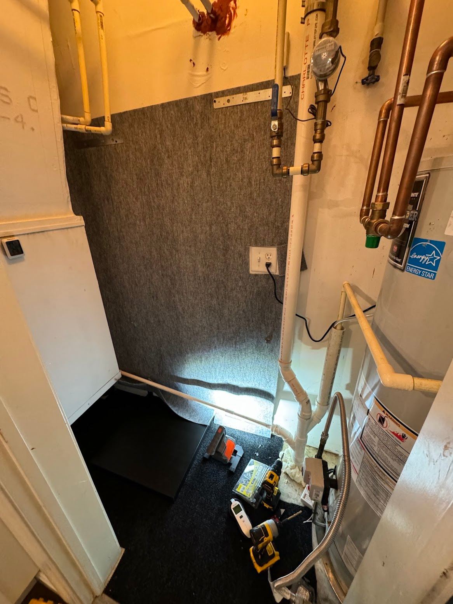
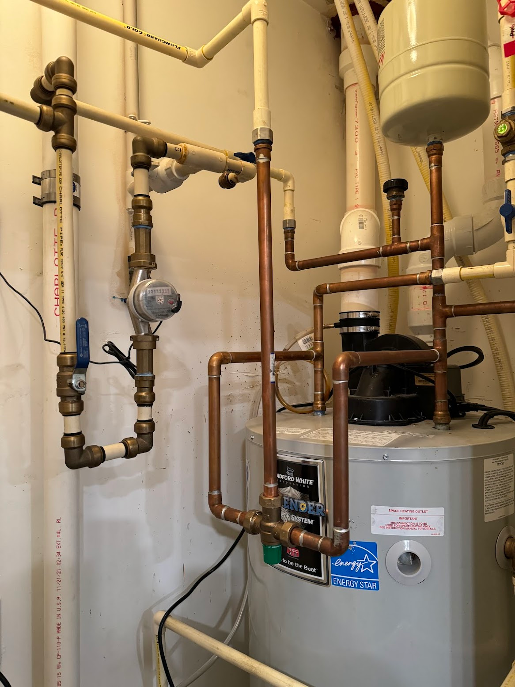
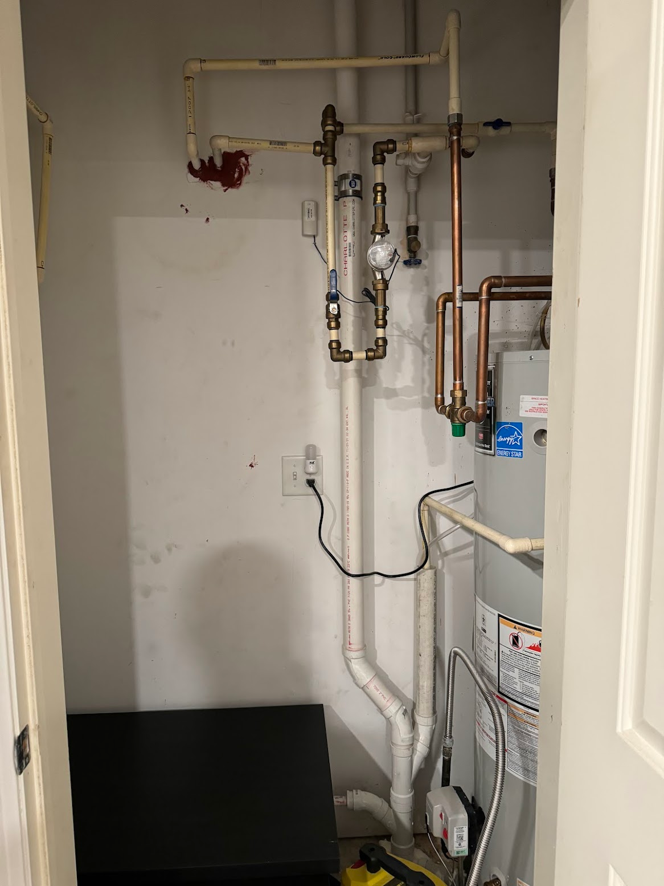
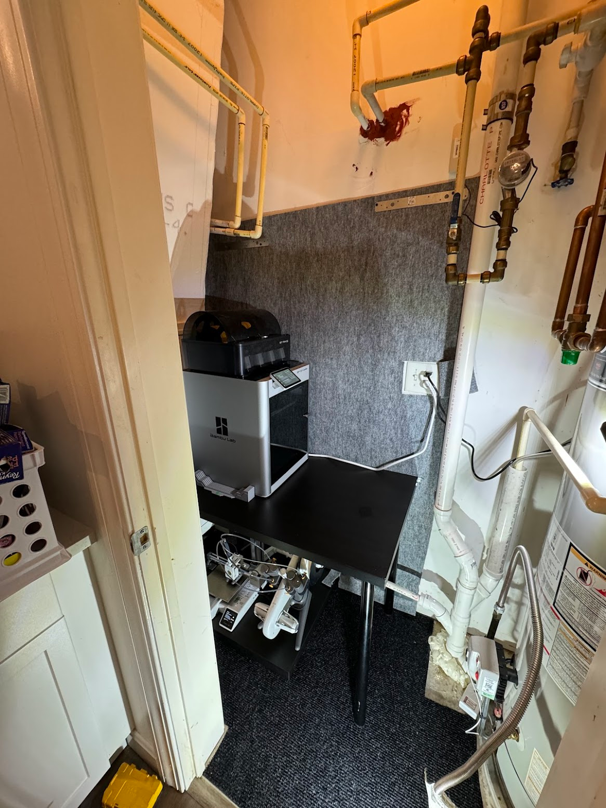
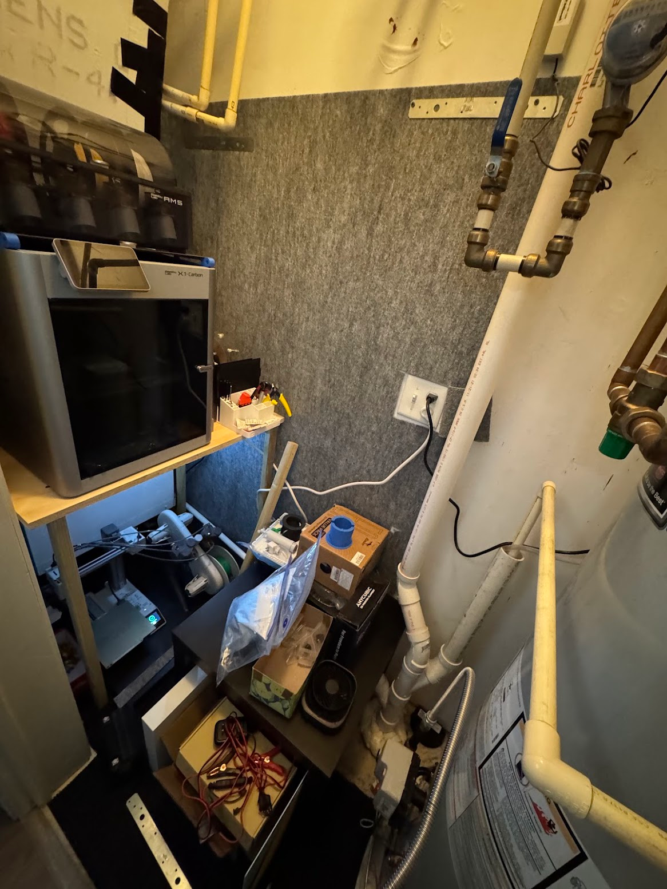
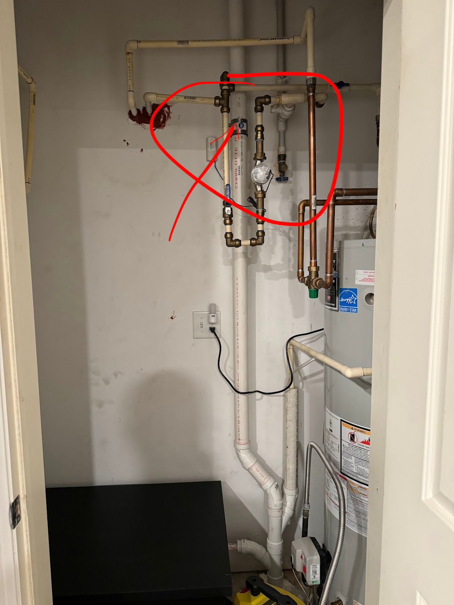

I moved the servers just in time.
<!--more-->

## The Boiler Room

Since [Werther couldn't find a place](/docs/projects/server-shelf/) in our home, I had to stash my junk in a pretty terrible spot: a small utility closet between the kitchen and the bathroom, which also happens to house a boiler on one side and an air conditioner on the other.

The closet isn't meant for residents to access and was kept locked, but given the limited space I had to open it up and put it to use.

The way a bunch of pipes are mounted there in suspension — I'll keep using that as an example of ~~slap-dash~~ good enough for a long time. Hopefully a very long time — I'm a bit scared to see something worse.

## The Printer Room

The arrangement of stuff went through several iterations, and I didn't think to photograph all of them (or simply can't find the photos).

Because the pipes hang everywhere in mid-air and even run along the walls at an angle rather than flush — every solution had to be fitted around that crooked mess. I sawed down tables, built custom shelves from plywood, brackets, and planks, bought wheeled carts — anything to cram the uncrammable.

## The Server Room

Because the servers hum and scratch away with their disks, and there was no good place for them, at one point two home NASes were sitting on the floor right in the middle of the boiler room (so they wouldn't wobble), stacked on top of each other, along with all their accessories — UPS, switch, etc.

When the maintenance workers came to clean the air conditioner and peeked into that closet, they gently hinted that I shouldn't be using it and that it wasn't a great idea in general.

On top of that, I was also tired of having the servers connected through a WiFi extender, since the utility room obviously had no Ethernet sockets.

I scratched my head and moved all the network and NAS equipment into the TV stand cabinet, making a child-proof lid for it out of plywood screwed in place — because the main point of hiding this equipment is to keep a young curious person away from it.

I managed to run a UTP cable to the cabinet, which significantly improved the speed — hallelujah. And the freed-up space in the boiler room went through yet another reorganization.

## The Flood (Minor Edition)

Hurriedly dismantling the setup and wiping up puddles, I even forgot to photograph any of it.

A large vertical plastic pipe "burst" — at the spot where a black patch joined two halves with two clamps. The lower section bent and popped out of its bracket, so water from the upper section flowed down onto everything that was standing below that pipe.

Fortunately, only spare parts and filament in bags were stored there, and the pipe itself isn't a sewage line but a condensate drain from the air conditioners and something from the boiler. So the flood turned out to be minor and trivial — there weren't even many puddles; most of the water had collected in small boxes, and the rest was absorbed by the garage mat I'd laid on the floor. And by the time I noticed the flood — nothing was leaking anymore, only the aftermath remained.

## Relocation

Realizing that with my stuff being where it shouldn't be, I'd have all the blame pinned on me — I had to urgently dismantle everything in the middle of the night. Wipe it down, take it apart, move it to storage.

The specialists, while doing the repair, mentioned by the way that the pipe had warped from hot water — somewhere above, the boiler had leaked, the water ran down and warped the pipe. And that there's a similar situation somewhere else in the building.

Lucky that only a battery-powered fan got wet among the electronics. The biggest loss is, of course, the wasted time, and the time needed for a new project — where to put all the junk now that the boiler room is compromised.

And lucky that the servers with their terabytes of stuff had left the epicenter of the disaster a couple of months earlier.
