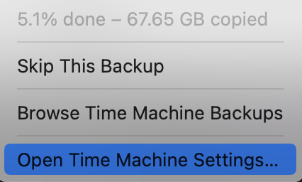

Time Machine is full — bring a new one.
<!--more-->
For reasons I don't quite understand, Time Machine refuses or fails to do what it's supposed to — push out older archives/versions when space runs out — and so it occasionally tells me "can't do it" and stops backing up.

Possibly because the destination is not a real Apple Time Machine device, but a specially configured (following some googled instructions) folder on [Synology](/tags/synology/)...

In the past I'd just wipe the folder and start fresh, but this time I figured — there's [extra space on Tesseract](posts/2025/01/11/used-hdd/) — so let's not throw it away just yet, we'll toss it later.

## Archive the Time Machine

```shell
$ time tar czvf /volume4/garbage/TimeMachineMaxbooka.2025-05-17.tgz /volume1/TimeMachineMaxbooka/

...
real    3753m26.940s
user    3641m48.425s
sys     149m32.053s
```

## Move the archive to the neighboring server

```shell
ansible@boxtree:/volume1$ time rsync --progress /volume4/garbage/TimeMachineMaxbooka.2025-05-17.tgz /volume1/tess/inbox-volume3/
TimeMachineMaxbooka.2025-05-17.tgz
2,617,104,238,550 100%  108.64MB/s    6:22:53 (total: 100%) (xfr#1, to-chk=0/1)

real    382m57.072s
user    272m56.536s
sys     157m33.856s
```

## Wipe the folder

```shell
time rsync -aP  --delete ./empty/ /volume1/TimeMachineMaxbooka/maxbooka.purgeable/
...
real    2m31.497s
user    0m0.212s
sys     0m12.455s
```

## Run the backup

Off it goes.


