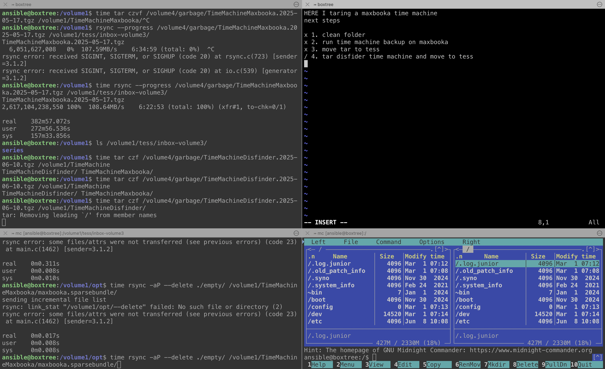

Notes to myself, like in [Memento](https://www.imdb.com/title/tt0209144/), or Post-it sticky notes on your grandma's monitor.
<!--more-->
During long-running processes on my home servers, I end up with a lot of tmux tabs and windows open — one is archiving something, another is downloading, somewhere else something is being moved around...

This often goes on for days — not only because packing 2 TB takes a while, but also because I don't check the terminal (or the laptop in general) all that regularly, and I forget what was happening where and how.

And so I arrived at a simple and — now seemingly obvious — solution: write in one of the panes what's actually going on here, what the plan is, and what comes next. A little todo for this tab with its three windows. Feels like genius to me.

