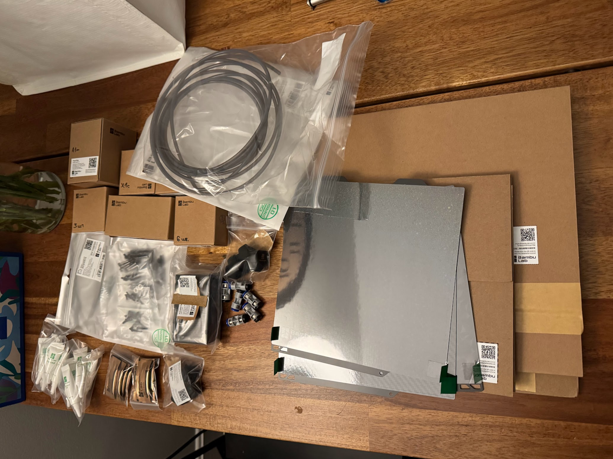
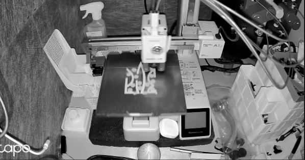

The camera in the printer broke.
<!--more-->
## The Camera Broke

I contacted support, and they said — order the camera module and replace it. Me: ~а чо бя єслі нє?~ but what if that doesn't help? Well then, dear sir, reopen the ticket and we'll be happy to assist you!

So I ordered the camera ($30), but shipping isn't free — which means I need to order something else too, and then boom, there's a sale — oh, I'll take this, and that, and one more thing, and another...

## The Order Arrived

So I ended up ordering $180 worth of stuff in total...

I'd been meaning to get a `PTFE adapter` for a long time, and a `Tube coupler` too — one thing led to another and there you go...

## The Camera

So I swapped out the camera — and it didn't help.

I write to support again — and they reply: oh, how unfortunate, well we've sent you a `main board` for your printer free of charge, here's the instructions on how to replace it.

I say — but what if it's the cable? — Oh, dear sir, in that case please reopen the ticket and we'll be happy to assist you!

## The Alternative

I read the instructions, looked at the board, scratched the back of my head — and since I'd recently taken a step toward a "smart home" by [setting up a few sensors (and more importantly, a hub)](/en/posts/2025/06/11/smart-sensors/), I bought an external camera for $20 that not only streams 1080p instead of some sad excuse for a video, but also sees in the dark and delivers a decent FPS.

And the motherboard for the printer can just sit around for now. Until something else breaks.
