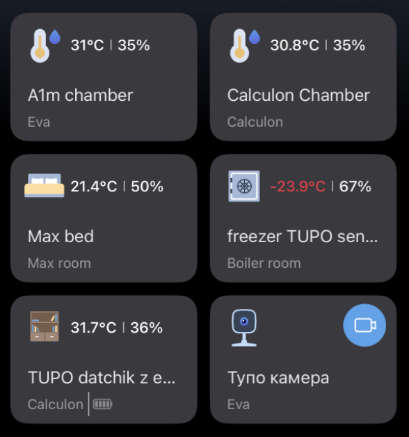
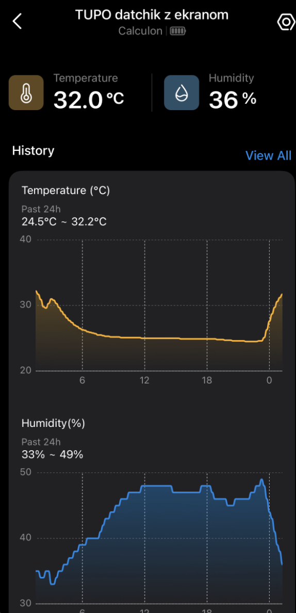
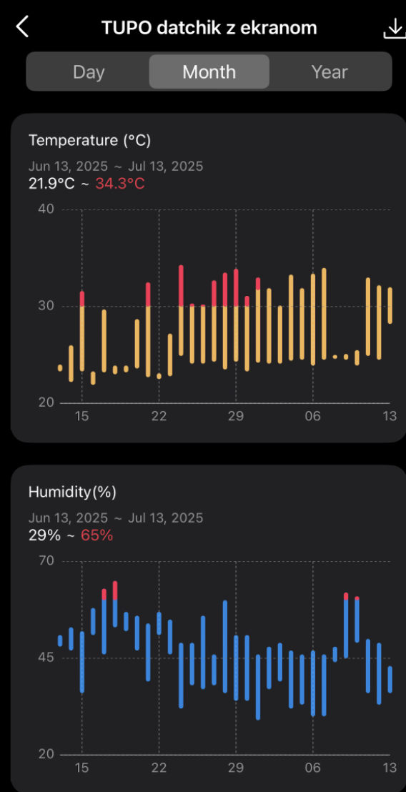
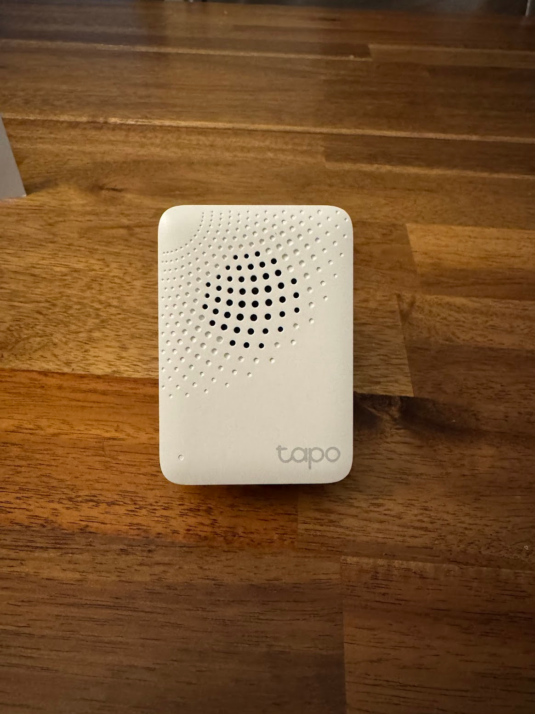
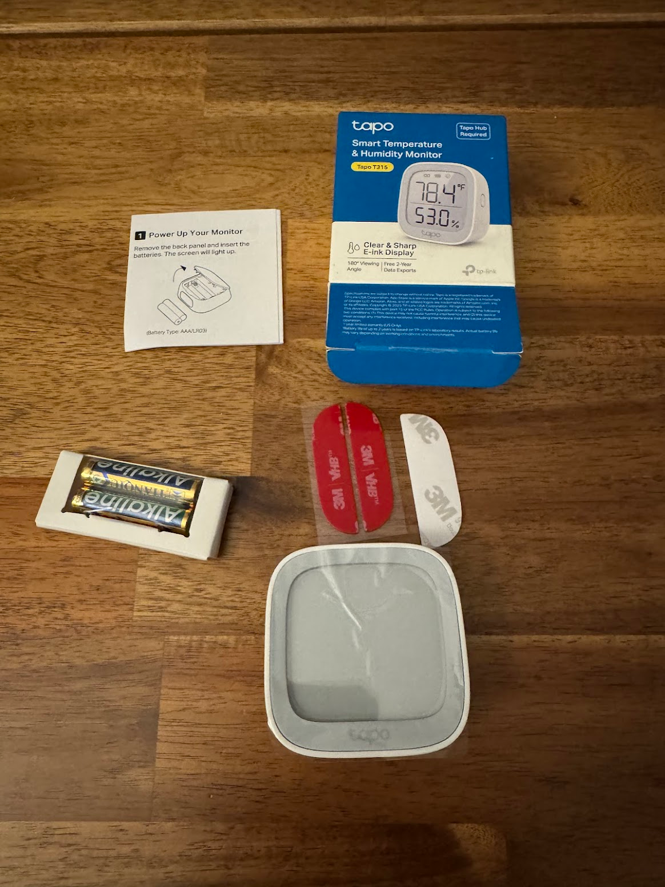
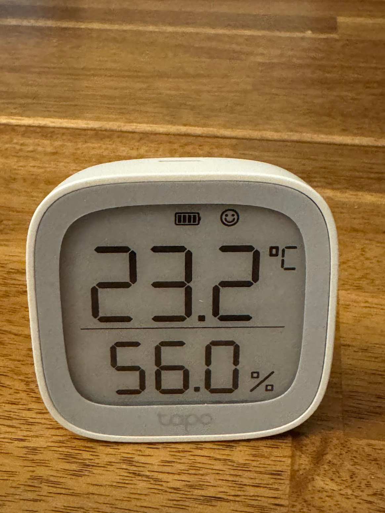
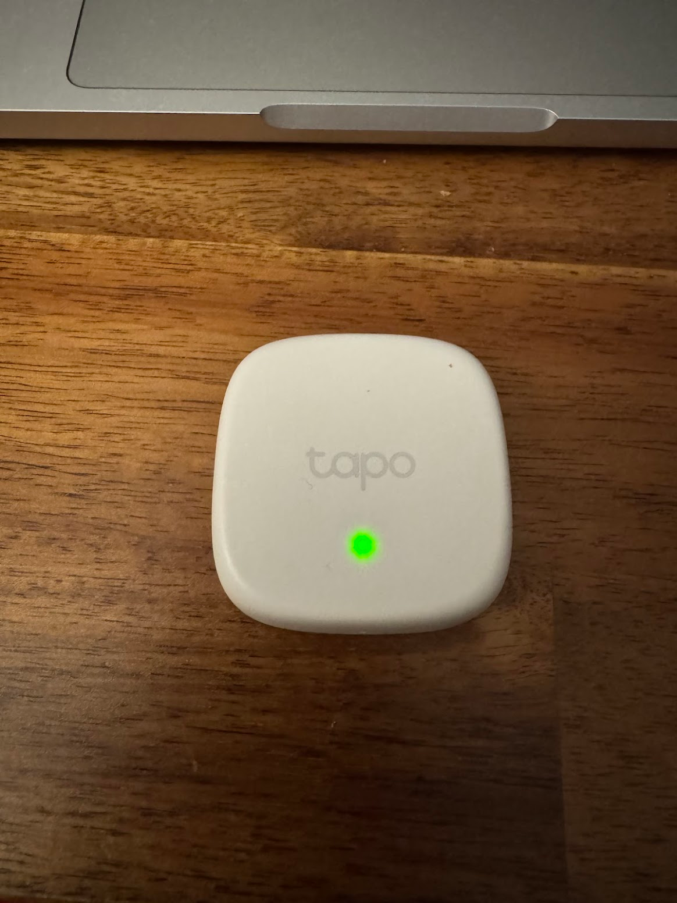

I've started to get a clearer picture of what IoT/smart home can actually do for you.
<!--more-->
Since the [Tardis](/en/docs/projects/tardis/) project (currently unfinished) is somewhat dangerous — printers in a closed cabinet can overheat and potentially even cause a fire — there's a need for monitoring and control.

## Platform

IKEA is too far away, and on Amazon you can cheaply get Chinese TP-LINK under the TAPO brand. I already have a Wi-Fi extender from TP-Link and honestly have no complaints other than the potential backdoors for the party — so I stocked up on TAPO sensors.

## Hub

As is probably the case with all such solutions, there has to be a vendor-locked hub to which everything else connects — a sensor won't work on its own.

The hub can also make various sounds: doorbells of different kinds, alarm signals, and so on.

Plugged it in, connected it in the mobile app, all good.

## Sensor with a screen

Although one sensor can actually work without the hub — it has an `e-ink` display and can show its readings (temperature and humidity) right on its face. And once connected to the hub, it starts collecting and reporting its measurements to a Chinese server, after which you can view both live and historical data (2 years, I think).
`

## Screenless sensors

The cheaper sensors that also measure temperature and humidity but only report to the hub — no screen — I've bought several of those.

## Freezer monitoring

In addition to monitoring the temperature of another printer in the Tardis, I tossed one sensor into the freezer.

Since the freezer sits in a storage room that [has flooded twice (so far)](tags/flood/), I also bought a water leak sensor and a smart plug.

In the app it's easy to configure smart actions — if the flood sensor triggers, cut power to the freezer outlet (so nobody gets electrocuted).

And also: if the freezer temperature rises above (say) -10°C while the outlet is on — send a notification (it shouldn't be defrosting while everything is powered on).

## Gateway of unlimited possibilities

There's also a door/window open sensor — you can configure it so that if a child opens a cabinet door, it sends a notification and/or triggers a siren, but that's for another time.

Oh, and [a camera as a replacement for the broken one](/en/posts/2025/07/13/printer-camera/) — that's part of the same story.
