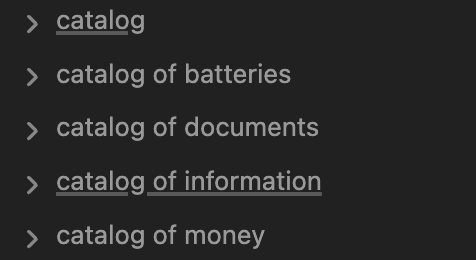

As a child, I always knew where everything was.
<!--more-->
And so in my household I was the main "tool" for answering questions like "where is that thing we need once a year...?"

Back then my head was empty and fresh, there weren't many things in the house, and their locations were more or less stable.

Today, with my head not quite as fresh, with things (thanks to capitalism and consumer society) having multiplied enormously, and with their locations having changed an incredible number of times across several moves — keeping all that data in my head has become hard, and failing to find what I need has become frustrating.

Back in the days when CD-ROMs were popular, I tried using catalog programs: they would scan a disc, record its file structure into their database, and that way, after scanning all the discs once, you could quickly search the entire "catalog" without flipping through them manually.
It seemed like there should be something similar for inventorying physical objects — surely I'm not the first person to have this need.

And then one day, while working on a somewhat different project — specifically, offloading information into a `second brain` using [Obsidian](https://obsidian.md/) — I accidentally stumbled upon a solution to the inventory problem using that very tool.

The idea appealed to me so much that I ended up creating several catalogs for myself, and even wrote it all up in a [separate article](/docs/articles/obsidian-catalog/).

