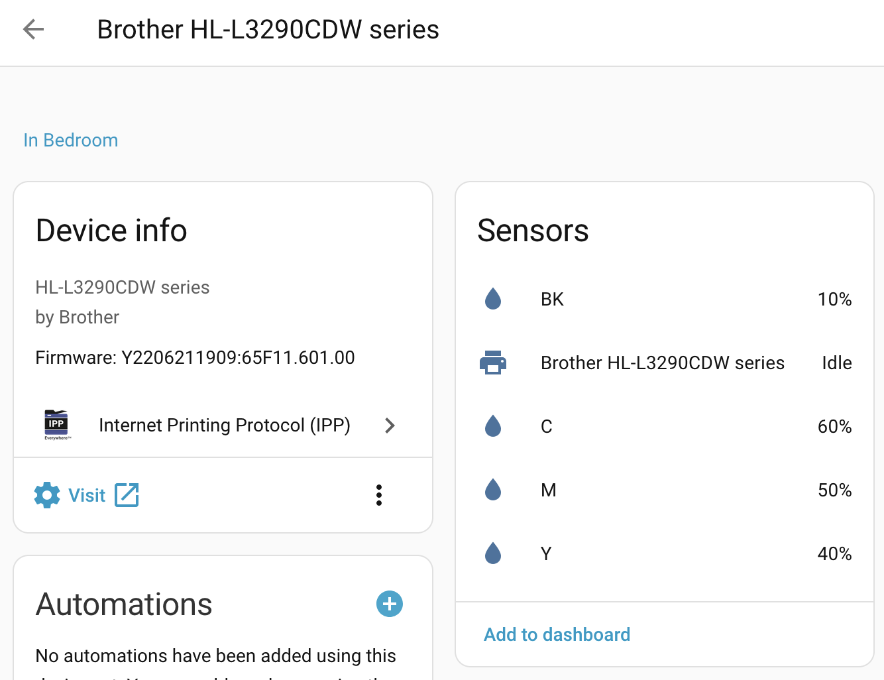
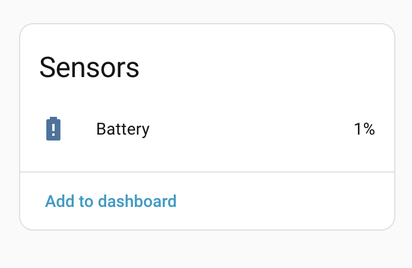
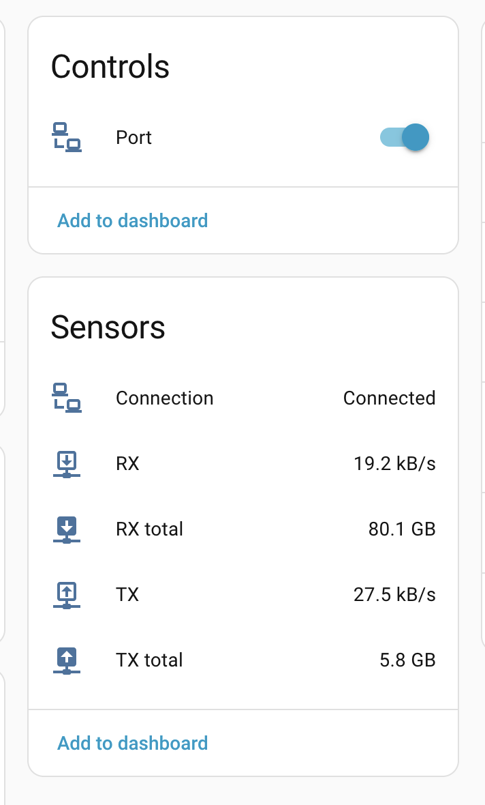

Out of nowhere I went and set up [Home Assistant](https://www.home-assistant.io/).
Oh my, what a beauty!
<!--more-->

And although there's still so much to figure out and play with this super-harvester (how sad I didn't have it 15 years ago!) — even a hastily and sloppily configured dashboard revealed something interesting: the laser printer that has been nagging me for a couple of months with "black cartridge is critically low on toner!" turns out to be reporting that it still has a full 10% left!

But the battery in the TV speaker remote, which also shows as weak in the IKEA HUB, is reporting a mere 1%.

Monitoring traffic on the router didn't work out as smoothly — all the ports were found using a [custom integration](https://github.com/tomaae/homeassistant-mikrotik_router), they're visible, but you can only enable/disable them; seeing how much data is flowing through somehow didn't work out. Googled for a few hours, gave up for now — it already turned out pretty cool as is. Maybe I'll ask [MrGall](https://mrgall.com/blog/2025/03/30/youtube-channels-feed) about it...

Anyway, I'll keep poking at it little by little. During the long winter evenings. ))))

## UPD: Got it working!

