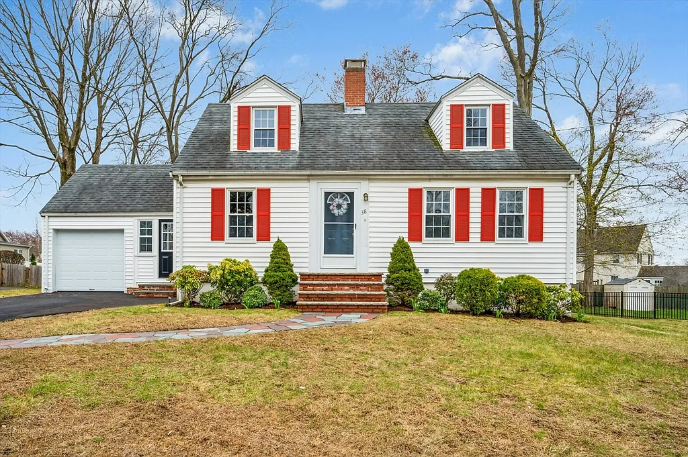

## Artificial Intelligence on the March

It's April 2026 outside (though the weather says February), the scythe of artificial intelligence is marching across the planet, mowing down dinosaurs, and tech giants are laying off people by the thousands.
<!--more-->

## Retropost
Out of superstition and some fear that "we'll share good news and then something will go wrong" — we never tell anyone anything in advance.
But you can't go on like that forever; there are emotions and you want to share them. As time passes, they fade, dim, get pushed out by new ones (not always joyful) or by chores and worries, and so you just live somehow in quiet solitude.
But I can write in the blog today, set today's date, and "send to print" — when it's all over (successfully or not).
So here's a way to use technology for communication.

## Plans and Intentions

We've been casually looking at buying a house for some time, because renting in the USA is incredibly expensive — almost as much as a mortgage.

But even considering that realtors here put in a lot of effort to help (in a good way), searching for a house is still a whole job:
- you have to browse listings
- check if the location works
- check if it's not too old (because houses from the 1920s and even 1890s are on the market)

If something catches your eye — you have to go and see it. And going all together only works on weekends, and if it's sometimes an hour's drive — that's a day's adventure just to see one house. And given that we (I) are not very familiar with the surrounding towns — you have no idea what will be around.

## First Attempt
The house we liked was about 50 minutes from our current place, not too old, not too small, accessible by commuter rail, and at an acceptable price. After walking through it — we decided we liked it, mentally hung curtains, planted imaginary cucumbers, and made an offer.

### The Bid
If a house is decent, several buyers will be interested in it, and accordingly the seller chooses from multiple offers. Ours was liked and made it into the top 2, and we were asked "how much can you add." We added as much as we could, and it turned out we added more than the competing buyers, but they were still chosen because they offered a larger down payment, which appealed to the seller more — it showed seriousness of intent and greater chances that the sale would go smoothly and on schedule. The seller had some requirement to sell quickly due to a job change.

### The Loss
~~When someone is better than you~~
~~When you lose~~
When hopes don't come true — it hurts. The imaginary curtains had to come down, and no harvest came from the planted imaginary garden. We were upset and shelved the idea — there was no time to look around, drive around, or learn more.

## Second Attempt
Unexpectedly, an interesting option appears near us at a very attractive price.

Since we don't have to drive far, and wandering through someone's house is quite interesting, we go look.
We like it — great. Not too old, two-zone air conditioning, heating, attic (!!!), fireplace, porch, yard — just great. It seemed there was even a garage, or a basement, or both (which would be a total jackpot).
### The Bid
But there were a lot of interested buyers for that house. There were more than a hundred viewings in one day alone, which is an order of magnitude more than usual. We made an offer, and were immediately told that among the worthy offers there would be a second round, so we genuinely believed in ourselves. We made an offer, leaving a little room to grow.
### The Loss
But the second round didn't happen — some buyer made a crazy offer 20% above the asking price, which is a lot. All the competing buyers, including us, got a massive rejection.

## Third Attempt
When I realized how much a house that suits us in condition and location actually sells for, and how far out of our reach it is — I relaxed, understanding that nothing was on the horizon for us soon.
So I went to the next viewing without any expectations.

### The Bid
But we unexpectedly liked the house. People had just been living in it — their stuff was still in the closets and food in the fridge — and its condition didn't trigger any aversion, the way it sometimes does, from smell, or dirt, or something else. There's a garage, a basement, it's not too old, central air conditioning and gas heating, a small yard. Everything's fine; the downside — it's small.

The asking price was inflated, so we made a more realistic, market-based offer.
### The Win
And we won.

## What's Next
Now while I'm pulling money from various distant pockets for the down payment, I still need to actually get the loan to buy the house.
The next milestone will be signing the purchase and sale agreement; before that, an inspection needs to happen — to check that everything is okay, nothing is rotting, leaking, or falling apart — and then moving toward actually closing the deal.

### The Bad
- will have to drain all savings
- and spend most of it on the loan, significantly curbing spending
- and the worst is what to do if (when?) our robot overlords take my job away
### The Good
- will have to curb spending
- having your own home (with a garage and basement!) opens the doors to countless opportunities for small interesting projects — many ways to spend time pleasantly, doing things with your hands, setting up your living space, organizing the chaos
