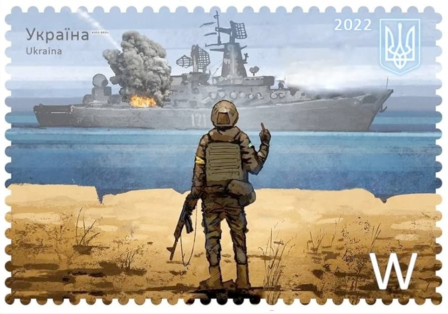

Запрошуємо всіх бажаючих помилуватися цією шикарною філателістичною перлиною під назвою ["Русскій воєнний корабль, іді… !"](https://uk.wikipedia.org/wiki/%D0%A0%D1%83%D1%81%D1%81%D0%BA%D1%96%D0%B9_%D0%B2%D0%BE%D1%94%D0%BD%D0%BD%D0%B8%D0%B9_%D0%BA%D0%BE%D1%80%D0%B0%D0%B1%D0%BB%D1%8C,_%D1%96%D0%B4%D1%96%E2%80%A6_!)

Будучи державною організацією, Укрпошта вимушена дотримуватися певних обмежень - в тому числі законодавчих.  
Будучи вільною людиною, автор таких обмежень не має, тому нагадує, що 

# РУСКІЙ ВАЄНИЙ КАРАБЛЬ ІДІ НАХУЙ  

англійською мовою зазвичай перекладають як

# RUSSIAN WARSHIP GO FUCK YOURSELF
