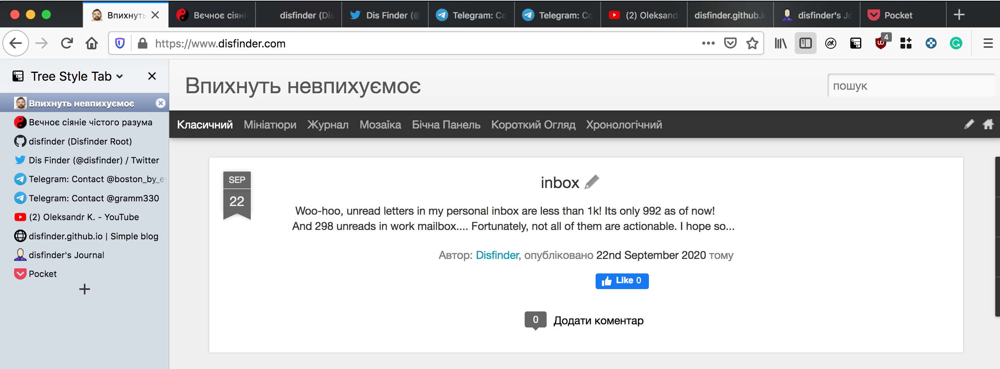
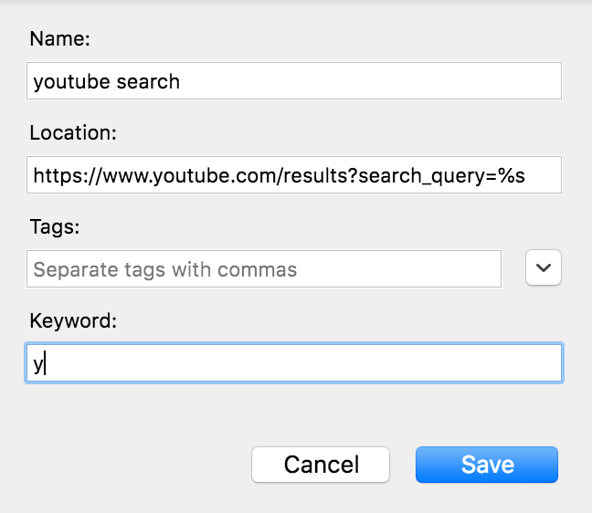

# why firefox is the best browser (2 killer-features)

Фаєрфокс - важкий, повільний, монструозний.

Як нам відомо із стародавнього жарту на башорг (коли баш був ще торт [господи, говорю як дід]):

```text
- як дізнатися, який процес у лінуксі жере найбільше пам'яті?
- echo firefox
```

## Introduction

Із переходом на движок Quantum стало дещо краще (хоча мені і не подобається ідея виділення окремого процесу на кожен із моїх >1024 табів), то я із полегшенням повернувся на улюблений Вогнелис. Однак до вчорашнього дня існувала лише єдина причина, чому він бест-оф-зе-бест, та раптово я відкрив для себе ще одну. Власне, це і спонукало мене на цей допис, тож далі - ці дві причини.

## 1. Tree Style Tab

Це плагін для відображення вкладок у бічній панелі у вигляді дерева. Для мене це зручно із  декількох причин:

- на широкоформатному моніторі зліва/справа зазвичай багато вільного місця (_так, я юзаю цей плагін ще із часів, коли дисплеї ноутбуків були (майже) квадратні!_)
- гугльож якогось питання і клацання по результатам створює нову гілку дерева - і коли питання вирішене - можна закрити всі вкладки разом (_це ж можна зробити, якщо відкривати нове вікно щоразу, але при моїй парадигмі буде більше 10 вікон, що не дуже зручно_)
- дерево - або mindmap - більш споріднена із мозком структура, аніж плаский список - тому зручніше орієнтуватися.
- навіть якщо банально відкрити 10 нещасних вкладок без ієрархії, в пласкому вигляді - то вкладки виглядають куди інформативніше, аніж в традиційній панелі. і це їх всього лише десять!


Я полюбив цей плагін ще бозна-коли, він чудовий. І через якісь особливості внутрішньої архітектури - такий функціонал неможливо реалізувати в Хромі! Я пробував, і є лише один плагін, що намагається відтворити таке - через створення нового вікна, тобто бічна панель вкладок - одне вікно, поточна вкладка - інше і воно так косо-криво намагається працювати. Виглядає жахливо, працює ще гірше.

Довгий час одного цього плагіну мені вистачало, аби терпіти всі Фаєрфоксові тормоза, пожирання пам'яті та той факт, що Хром зараз - новий Експлорер, тому безліч сайтів - працюють криво, а гуглові  наприклад - диск, фото, ютуб -  банально тормозять ще дужче: в радіо-т розповідали, що гугл був пійманий на тротлінгу та видачі різних сторінок для "свого" хрома та інших браузерів (_спробувати підміняти юзер-агент чи шо...._)

Та друга кіллер-фіча, якої немає в хромі, і яка власне надихнула мене на цю графоманію, це

## 2. Custom search або Keywords in bookmarks

Фаєрфокс із коробки вміє шукати у декількох пошуковиках: наберіть у адресній панелі

```text
@wikipedia foo bar
```

і замість вашого дефолтного (гугла) отримаєте пошук у вікі, `@ddg` дасть DuckDuckGo, та власне що я розказую - вони всі оно тут: [about:preferences#search](about:preferences#search)  
Однак щоб пошукати, наприклад, в Ютубі - такого немає. А із цього і почалося - я спіймав себе на тому, що досить часто щось шукаю в ютубі, ліньки пуцати слово, і я хочу через 

```text
y fly me to the moon
```

послухати Сінатру.

Так ось: вирішення цієї задачі можна зробити через **keyword** у закладок! Якщо ви, як і я, не знали, що то:

- будь-якій закладці можна призначити keyword - скорочення, ввівши яке у адресну строчку - отримаєте ту закладку
- сама власне закладка може бути динамічною і за допомогою плейсхолдера **%s** все, що ви ввели після keyword - буде підставлено в URL!




**КККомбо!** Більше не треба вишукувати плагіни, щоб пошукати десь у Google Maps або у JIRA або ще де! Зроби собі закладок, яких треба, навішай на них одно-дво буквенні скорочення - і навігація виходить на новий рівень! 

Це настільки бомбезно, що на робочому ноуті я вже обріс скороченнями на кшалт:

- J    - перейти в Джирі по повному номеру таски:
      J PROJECT-123 -> https://jira.com/browse/PROJECT-123
  корисно, коли копіпастиш номер звідкись - чат, емейл, тощо

- JN - в тій же джирі го в основний проект тільки по цифрі:
       JN 123   ->  https://jira.com/browse/MYPROJECT-123
   цим я користуюся, якщо номер тікета хтось диктує або сам пам'ятаю чи бачу і вводжу руцями

- JB - просто статичне посилання на дошку (Jira Board)

- W - пошукати в корпоративному Confluence

- T - перекласти слово із англійської за допомогою Google Translate

- TZ - відкрити закладку із таймзонами нашої команди.

В персональному - пошук по ютубу та картах (Y та M), однак бачу в цьому великий потенціал для розвитку.

## Conclusion

Всім, хто терпляче дочитав аж сюди - сподіваюся, вам було цікаво або корисно. Якщо ви це і так знали - круто, напишіть це в коментарі. А якщо ні - ну що ж, може я недаремно це писав )

PS. мабуть міграція із мишкоклацання до операцій із "командним" рядком - це перший і маленький крок до vimperator, але до цього я ще точно не готовий..

## Update

[Оригінальний допис](http://blog.disfinder.com/2021/02/why-firefox-is-best-browser-2-killer.html) був написаний пару років тому, і зараз (грудень 2023), портуючи цю статтю із блогу в статті, я хочу відмітити, що друга кіллер-фіча для хрома таки існує: в Хромі можна додати "кастомні пошуки" і це з точки зору користування працює так само - можна зробити чи статичний шорткат на сторінку, чи пошук із плейсхолдером. Налаштовується тут:  
[chrome://settings/searchEngines](chrome://settings/searchEngines)