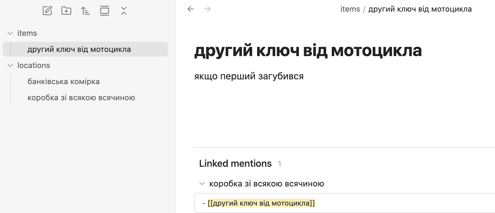
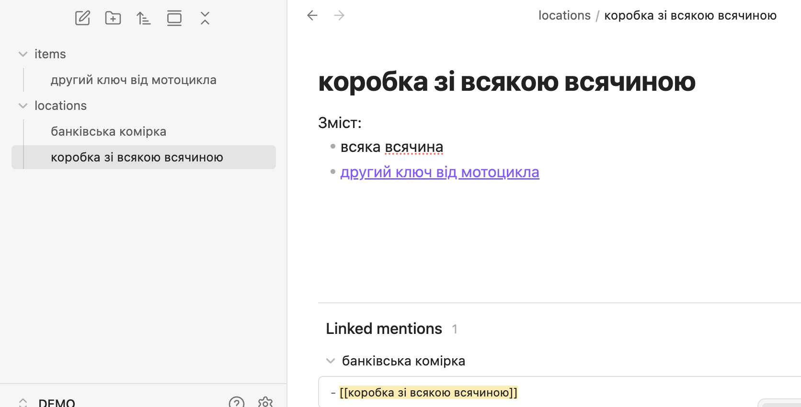
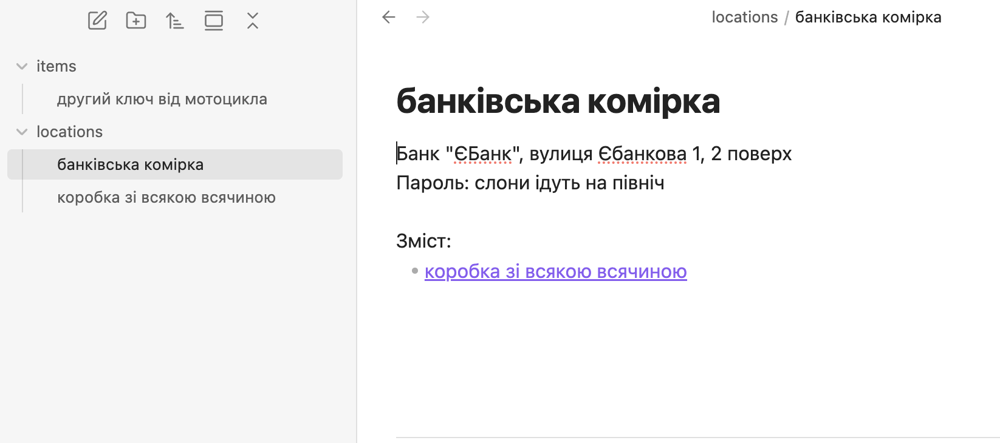
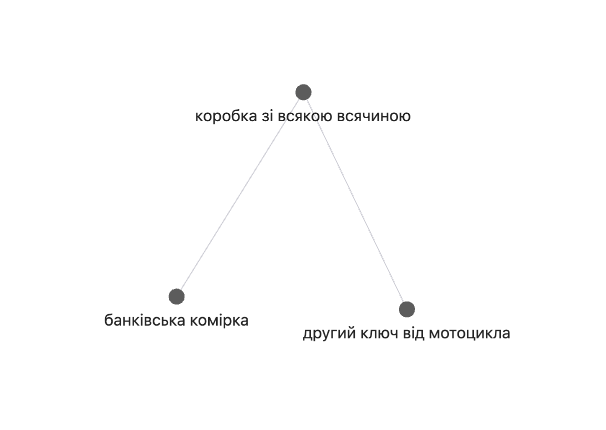
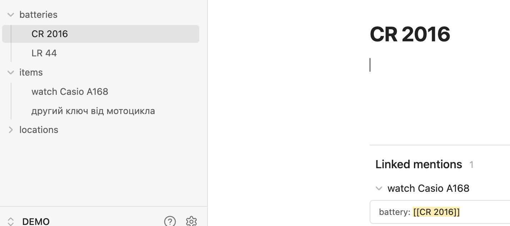
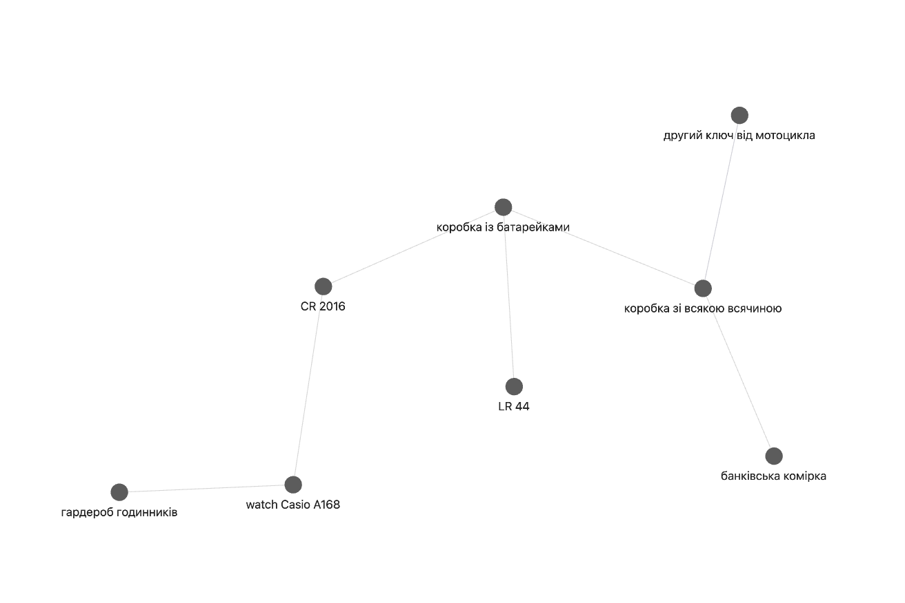
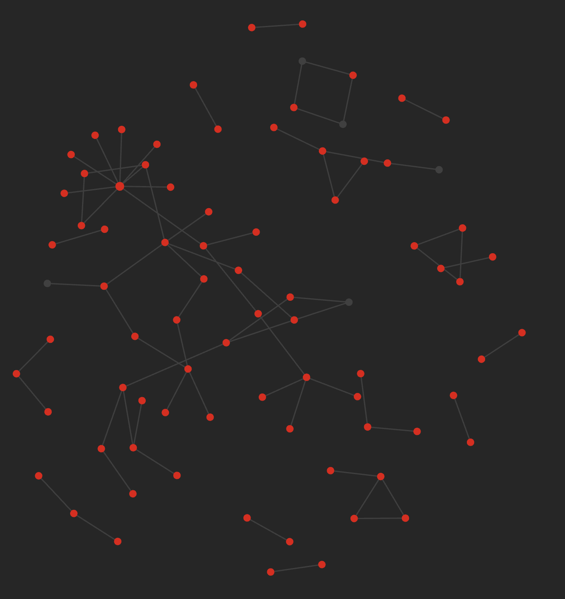

# Каталог важливого (будь чого)

## Intro

> In library and information science, cataloging (US) or cataloguing (UK) is the process of creating metadata representing information resources, such as books, sound recordings, moving images, etc. [^wiki]

## Яку проблему вирішуємо


Отримати відповідь на питання: що де знаходиться.


Бувають такі речі, які не потрібні у повсякденні, але як знадобляться - то важливість їх кричуща.

Наприклад - другий ключ від мотоцикла. Він не треба, поки не загубився перший, але вже як став треба - то дуже бажано знайти його швидко і без нервів, не перериваючи сто мільйонів коробок.

## Які вимоги до рішення

Крос-платформенне і `unbreakeable` рішення, що дає відповідь на питання: що де знаходиться.

Під `unbreakeable` я маю на увазі що через 20-40-80 років, на квантовому 256-~розрядному~ кубітному кишеньковому компьютері фірми "Груша" цей каталог все ще працюватиме, незалежно від того, чи [відмовиться фірма "Груша" підтримувати 128-кубітні процесори](https://support.apple.com/en-us/103076), чи ні.

Іншими словами, це має бути відкритий і простий формат, щоб у випадку коли програма для обробки цього формату гигнулася і більше не працює, можна було написати скрипт на пітоні для експорту чи якоїсь іншої взаємодії із каталогом.

## Рішення

[Obsidian](https://obsidian.md/)

Інструмент для створення `second brain` - не впевнений, що треба багато про нього пояснювати, досить популярний опенсорсний електронний фічастий редактор Markdown файлів.

У найгіршому випадку (якщо [гугл купить і вбʼє](https://killedbygoogle.com/) Обсідіан), маркдаун із тегами-метатегами легко розпарсити.

Поки ж Обсідіан живий і працює - за допомогою посилань (reference) та фічі відображення зворотніх посилань (back-reference), можна легко побачити

- що в нас є описаного в каталозі
- та де воно лежить (до чого відноситься, куди посилається)

## Як це працює

Позаяк все що є у Обсідіані, це записи - то треба завести (для прикладу) два:

- запис про власне річ, item
- запис про локацію
- зробити посилання у локації на річ

Покласти ці записи для зручності у папки `items` та `locations` - бо ж у подальшому їх буде більше, і зробити посилання.

## Приклади

### Де другий ключ від мотоцикла

Все клікабельно, і завдяки Обсідіану можна легко побачити, що ключ від мотоцикла лежить у коробці зі всякою всячиною, яка в свою чергу - у банківській комірці банка "Є Банк"

Обсідіан навіть дозволяє це візуалізувати у вигляді красивого графа:

### Батарейки

Не тільки відповідь на питання, що де лежить, а і яку батарейку воно потребує - і зворотнє питання "куди ~~запхати~~ підходить ця батарейка"

### Приклад із реального волта

Коли обʼєктів трошки більше, аніж у демо сайті і звʼязність між ними теж вища, це виглядає приблизно так:

## Conclusion і розвиток ідеї

- каталог інформації - що де лежить
- каталог бекапів - що куди бекапиться
- каталог фізичних документів - паспорти, тощо

[^wiki]: [Cataloging (library science)](https://en.wikipedia.org/wiki/Cataloging_(library_science))