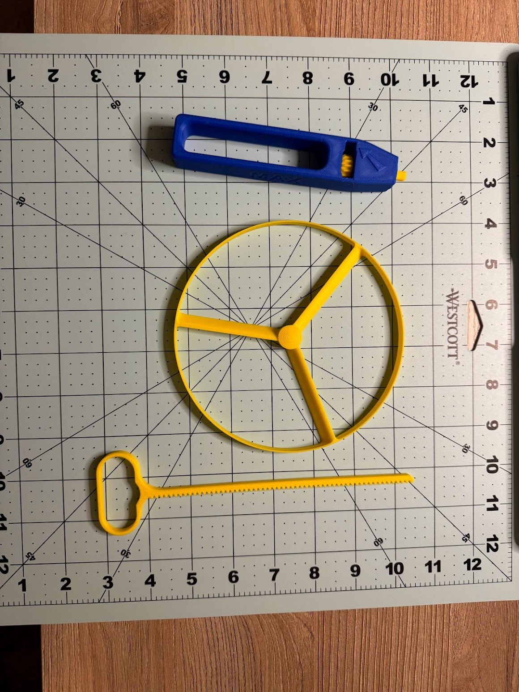
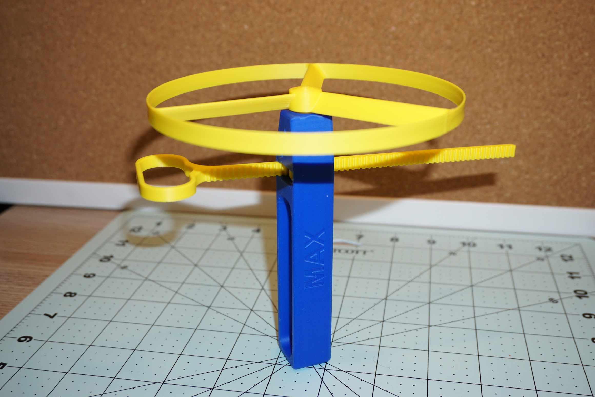
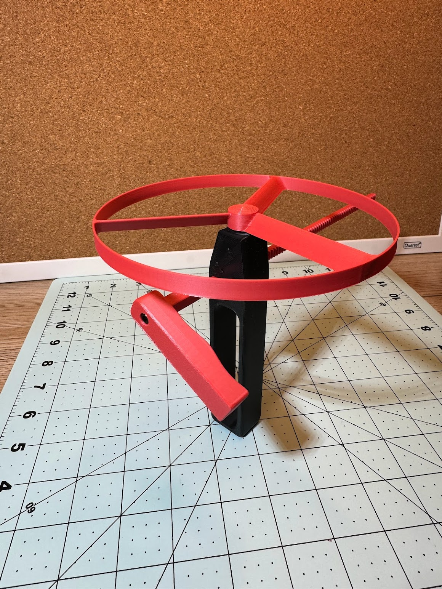
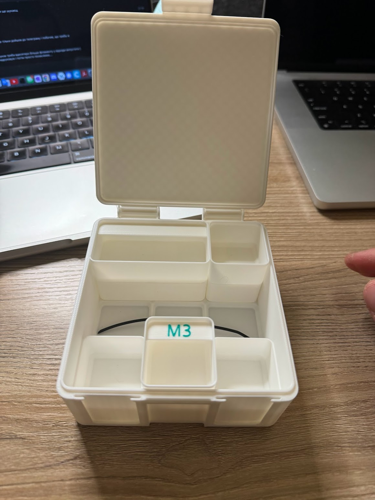
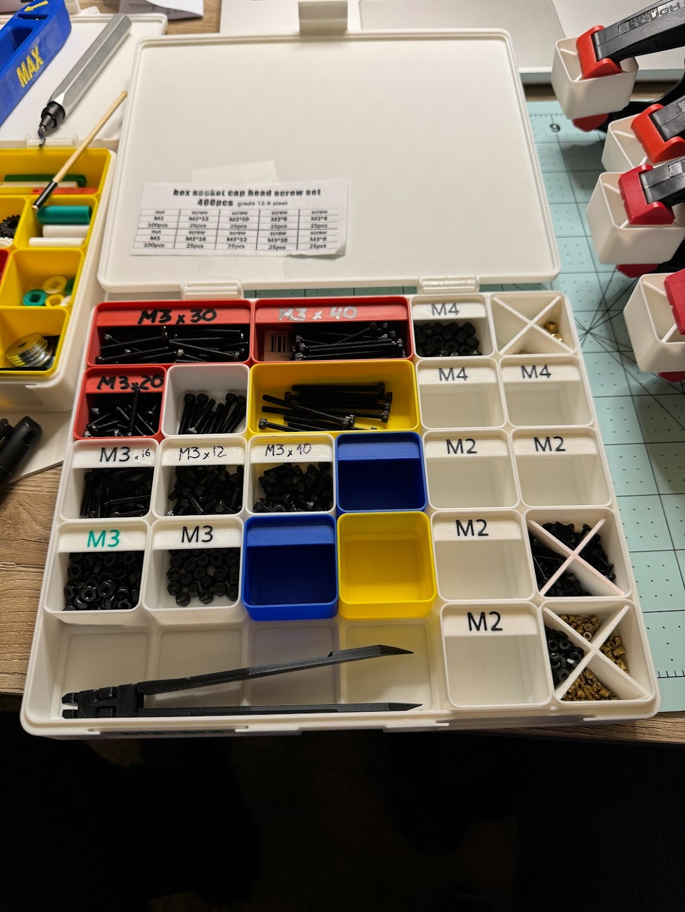
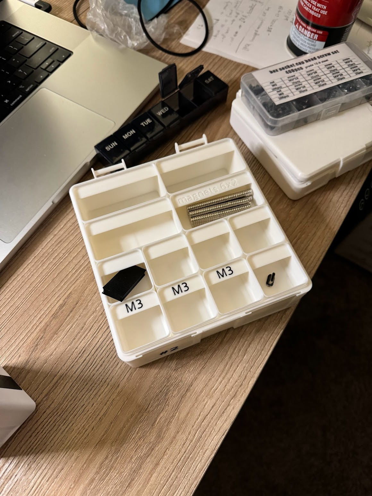
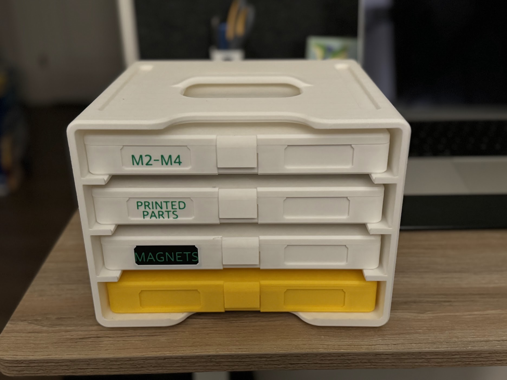

Підбірка того, що я друкував і друкую для використання або розваг
<!--more-->

## Strong Flying Propeller

[Strong Flying Propeller / Pull Copter (No Supports)](https://www.printables.com/model/227852-strong-flying-propeller-pull-copter-no-supports)

Це мабуть best of the best, надрукував гору варіантів і купу пропелерів, собі і друзям.

## Tiny Bins

[Tiny Bins - Efficient Small-Parts Storage [Parametric]](https://www.printables.com/model/701118-tiny-bins-efficient-small-parts-storage-parametric)

Шикарні маленькі коробочки для дрібʼязку, які можна поскладати у більші коробочки із кришками, а в свою чергу - у велику тримачку. Супер.  
Для цієї моделі я навіть "скастомайзив" перегородку, щоб поділити малесенькі біни на 4 частини - і вклеював ту перегородку у біни.

## Catch-All Trays

[Catch-All Trays / Desk organizer - stackable remix](https://www.printables.com/model/399667-catch-all-trays-desk-organizer-stackable-remix)

TO BE CONTINUED...