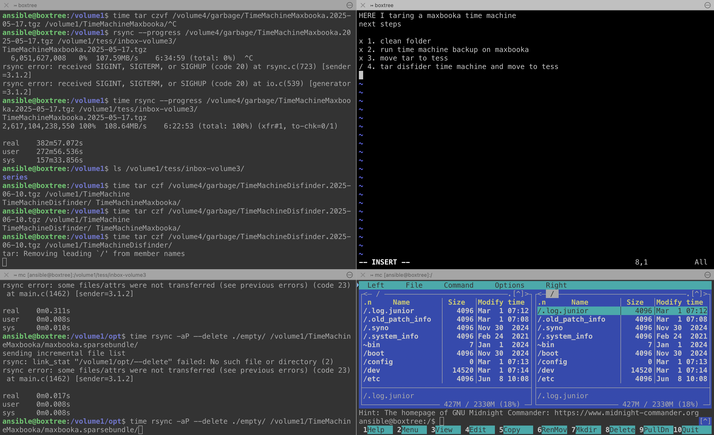

During long tasks on home servers, I often lose track of what's running in different tmux windows. A simple solution: write a brief note in one window with the current process and next steps. Helps keep everything clear.
<!--more-->
