Світло - це важлива частина життя.

## Маленьнький Alonefire

|      |       |
| ---- | ----- |
| рік  | 2017  |
| ціна | $3.28 |

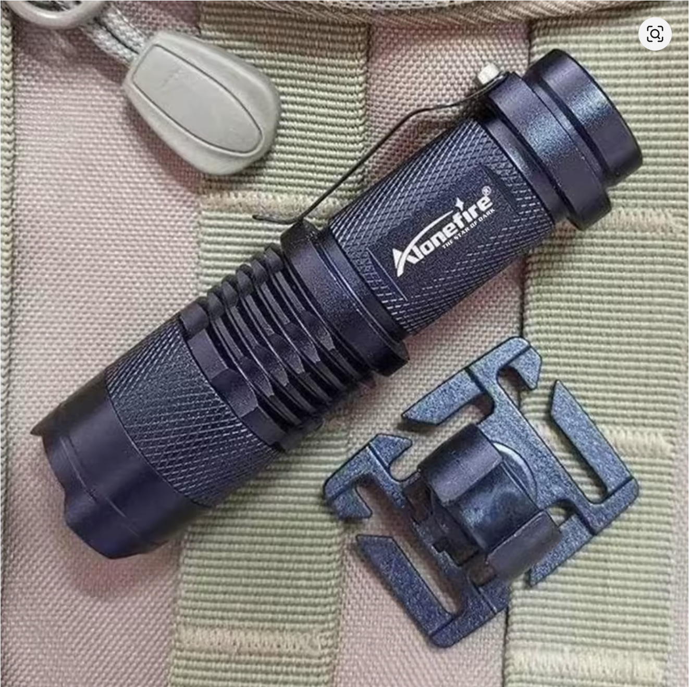

Назва на Aliexpress: `USA EU Hot SK68 CREE XPE Q5 LED Mini Flashlight Portable Zoomable CREE Q5 led torch flashlight lamp Lighting For AA or 14500`

Мій goto ліхтарик. Маленький, поміщається у кишеньку сумки і в пащу, якщо треба дві вільні руки. Пальчикова батарейка або її 3хвольтовий аналог `14500`. Базові функції - світити, світити слабше, мигати. Є зум.

## Великий Alonefire

|      |       |
| ---- | ----- |
| рік  | 2022  |
| ціна | $9.88 |

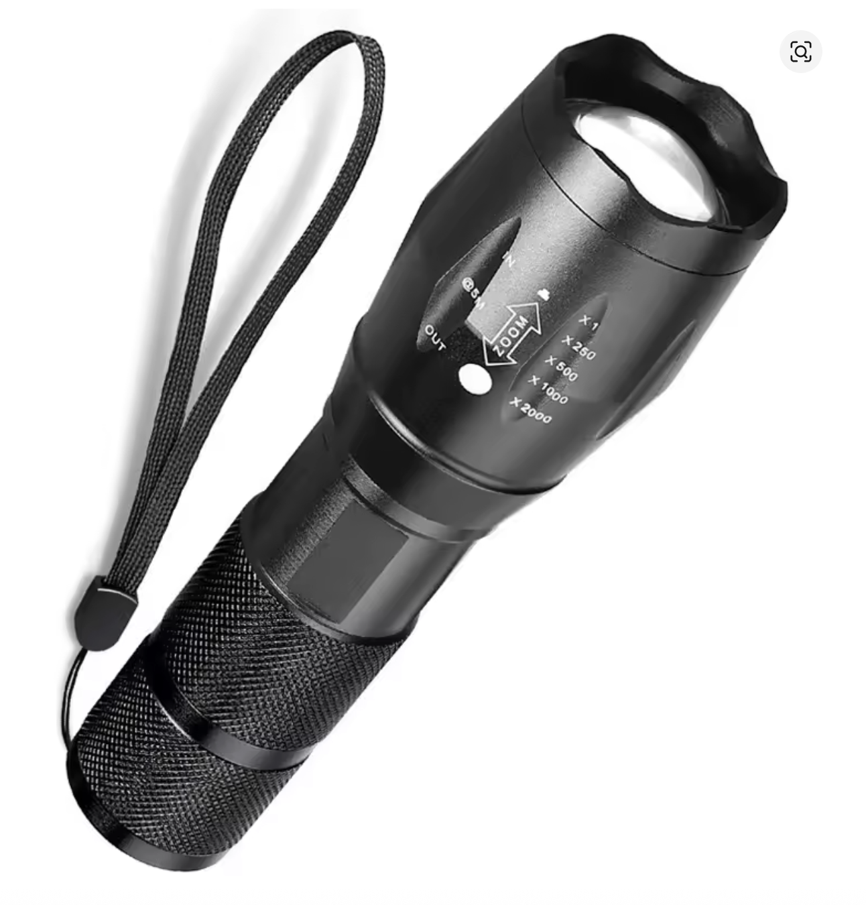

Назва на Алі: `Powerful G700 Flashlight XML T6 L2 led Aluminum Waterproof Zoom Camping Torch Tactical light AAA 18650 Rechargeable Battery`

Теж куплявся кілька разів і це я знайшов не саме останнє замовлення.
Великий і досить яскравий, за $10 баксів із 18650 батарейкою та зарядкою - але не знайшов багато застосування. Норм якщо треба десь яскраво насвітити, зазвичай коли треба щось дістати із темного кутка чи під диваном.  
На кемпінгу не дуже ставав у пригоді, носити із собою - завеликий.  
Перший врешті пав у нерівному бою із допитливою дитиною, другий поки живий, але де він тепер - неясно...

## Energizer Зелений

|      |      |
| ---- | ---- |
| рік  | ???  |
| ціна | ~$15 |
|      |      |

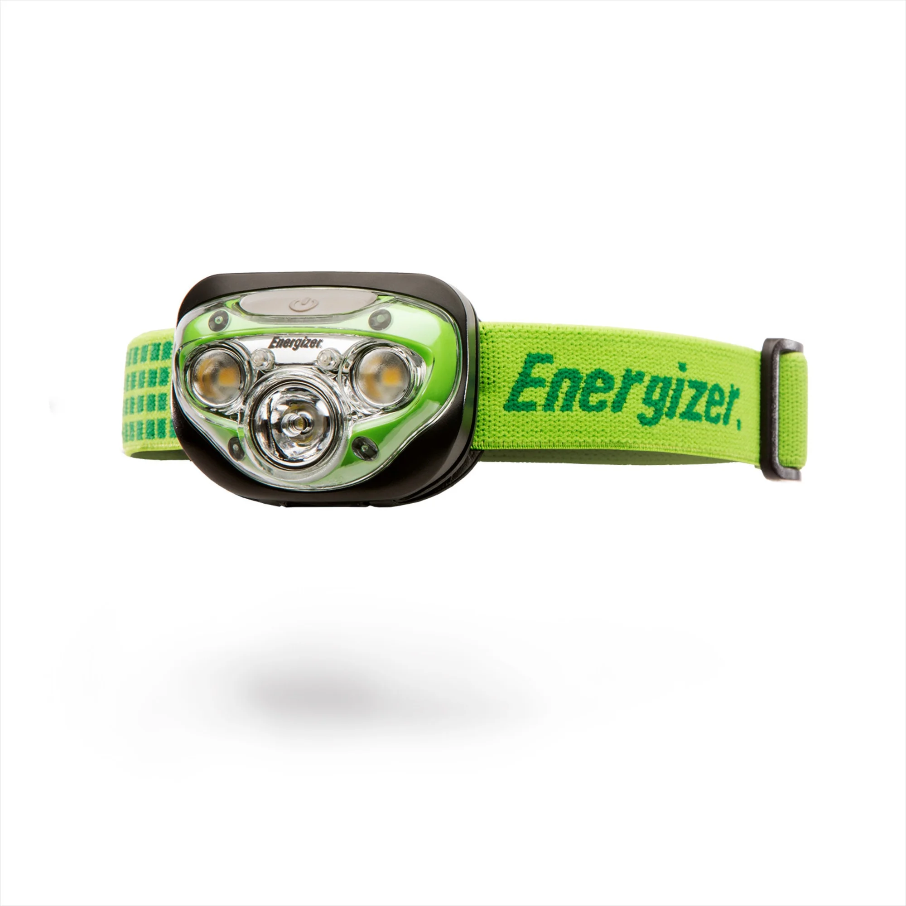

Купувався на кемпінг і виявився суперовим налобним ліхтариком:

- червоне світло не шкодить "нічному" баченню - не знав про це
- 3 ААА батарейки - не треба заряджати
- широка шлейка - не тисне голову
- три режими: фокусований, ширококутний, обидва + окремо червоне
- світить достатньо яскраво і батарейки садить супер повільно
- є регулювання яскравості
- простецьким лайфхаком перетворює банку води на настільну лампу

Так сподобався, що купив ще один, червоний - а він виявився без червоного діода. Ну як так?

## Nitecore NU25 400 UL

|      |        |
| ---- | ------ |
| рік  | 2023   |
| ціна | $36.95 |
|      |        |

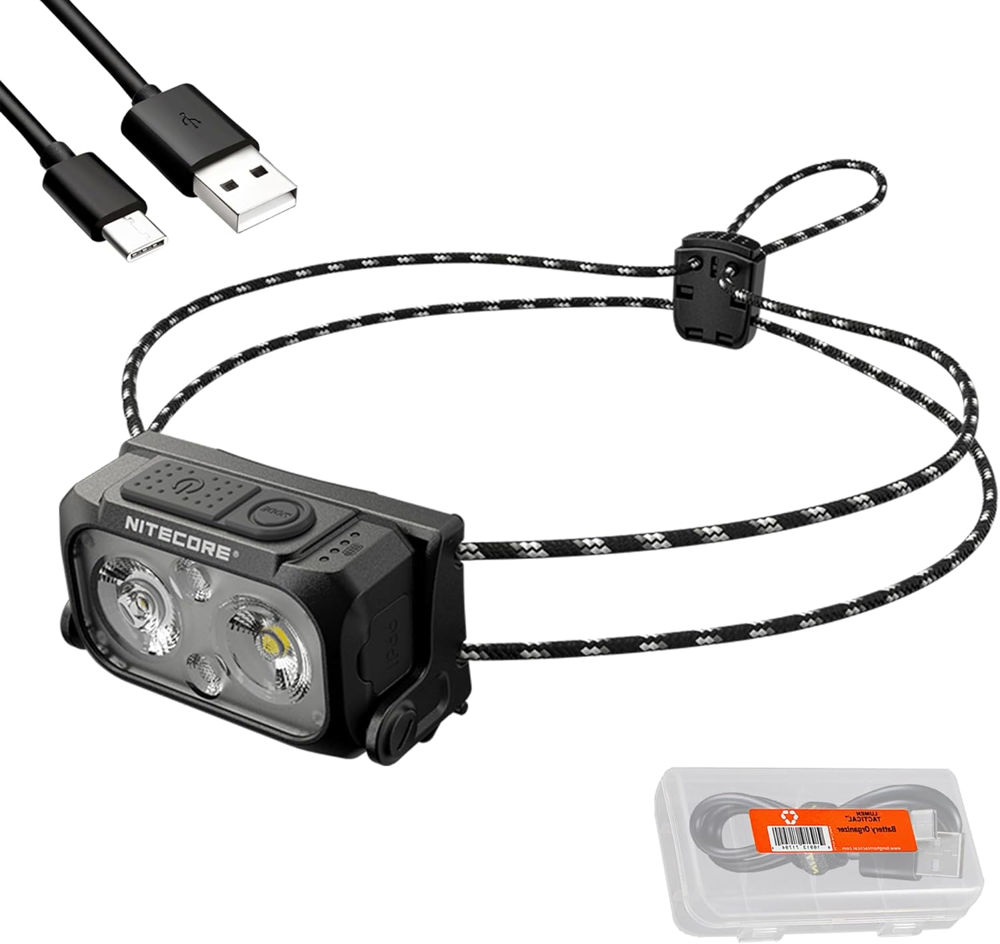

Захотілося ліхтаря від мажорного бренду. Заряджається по USB-C, має червоний діод і кілька режимів світла (два діоди, spotlight і floodlight). Лупашить досить яскраво, але не регулюється. Щоб включити - треба кнопку натискати і тримати (бісить). IP66 water resistant. До голови вішається тоненькою резинкою, яка трошки неприємно тисне.  
У підсумку - дорожче і гірше за Енерджайзер...

## Wuben X4

|      |                |
| ---- | -------------- |
| рік  | 2025           |
| ціна | HK$ 503  ~ $64 |

Купував на кікстартері, приїхало через півроку після покупки.  
Сука, зараз на Амазоні за $50.

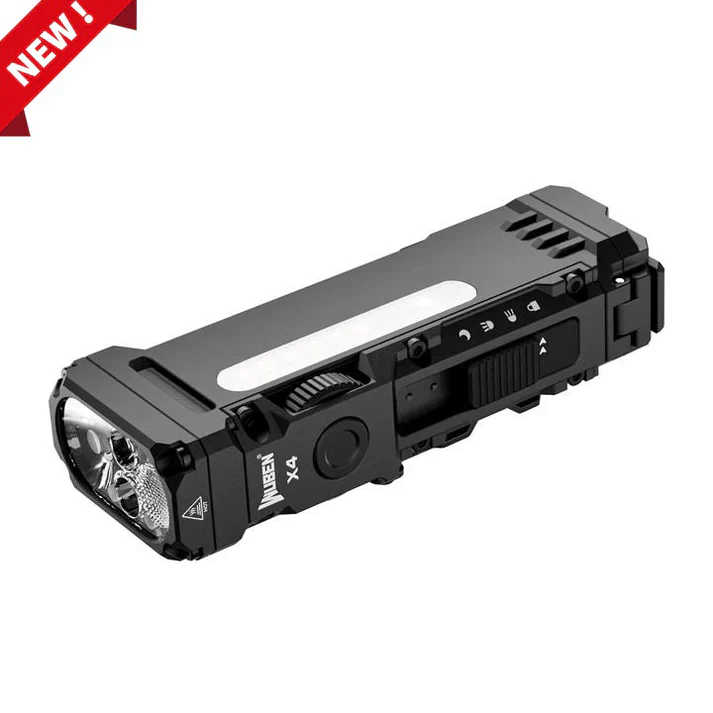

Він дуже прикольний фіджет. Гарно і так приємно клацає. Повзуночок перемикання 4х режимів (блок, спот, флад, мун), кнопочка вмикання, коліщатко регулювання яскравості, ще додаткова press&hold кнопка хвості (світить поки тиснеш) - все просто чудове враження справляє.

- батарейка 18650 на 3400 mAh
- магнітна жопка
- кліпса для кишені
- компактний
- кріплення для вєліка
- IP68 waterproof

{}
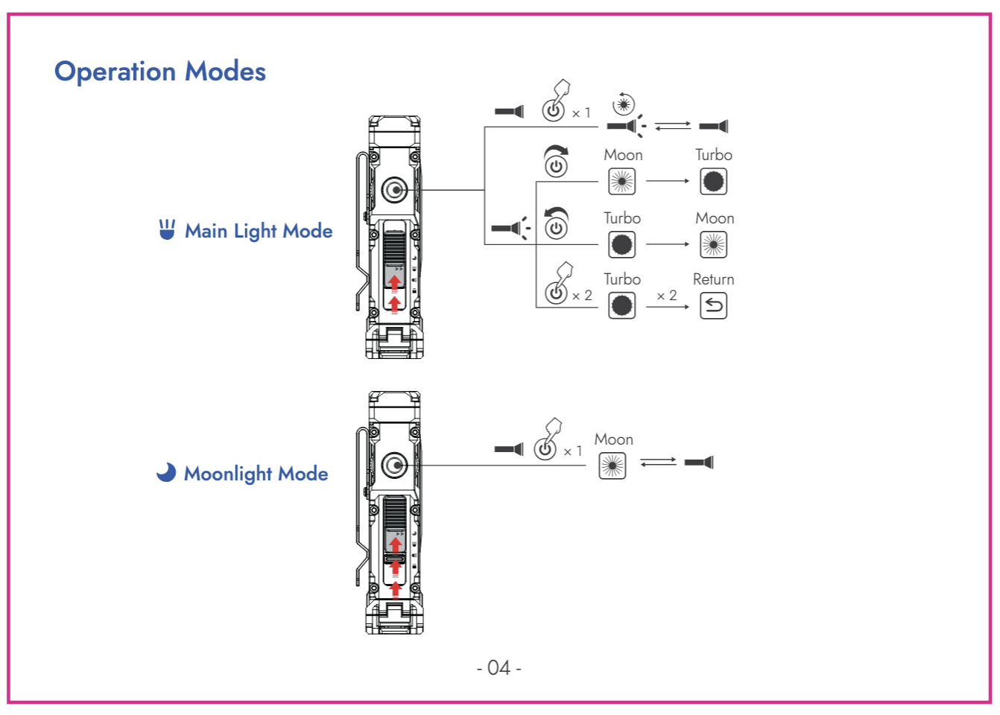
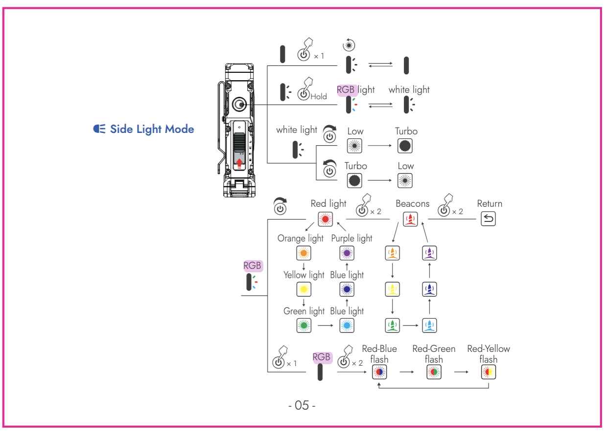

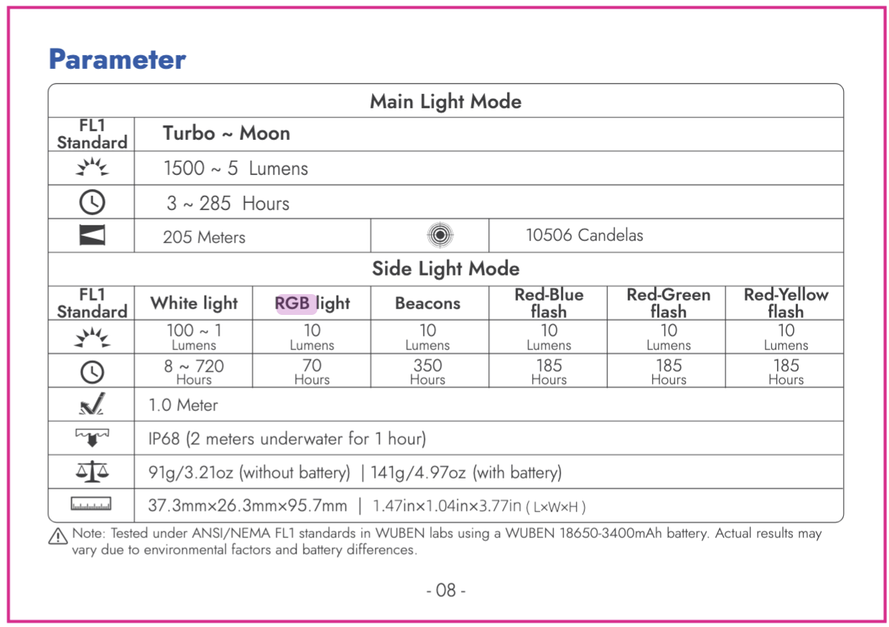
{}

## [Wuben C60](https://www.wubenlight.com/products/wuben-l60-zoomable-flashlights-1200-lumens)

|      |      |
| ---- | ---- |
| рік  | 2025 |
| ціна | 0    |

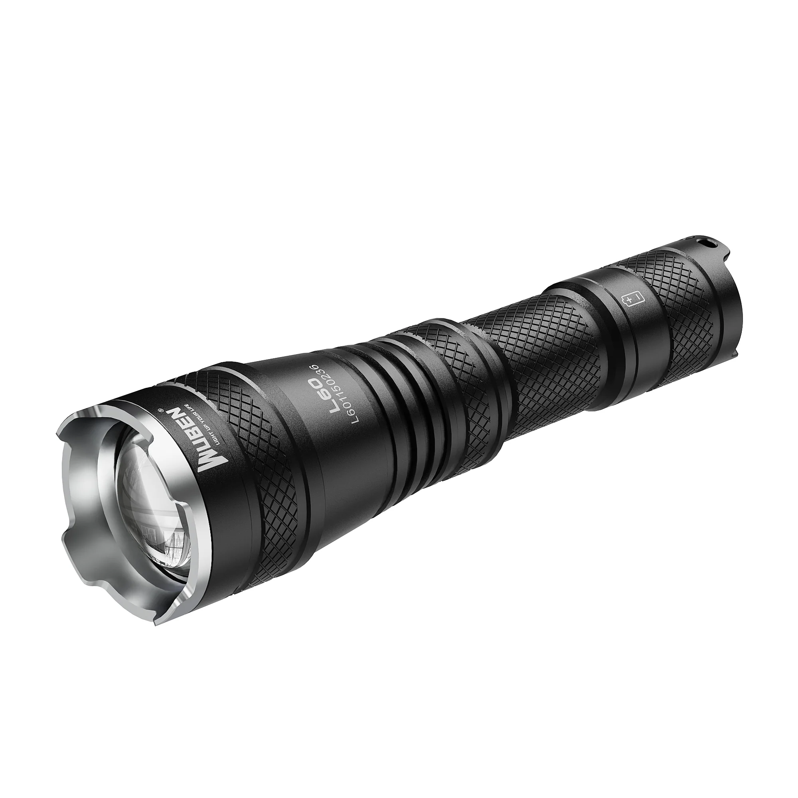

Разом із X4 добрі люди із кікстартеру прислали ще додатковий ліхтарик та таку ж 18650 батарейку на 3400 mAh.  
Тепер не так обідно, що заплатив за все разом 65 баксів.

Ліхтарик - розказувати особливо нічого. Дуже подібний до великого Alonefire із Аліекспресу, зум, три режими яскравості, все. Як "нахаляву" то норм, як за 40 баксів - то начє і не треба.

## Sofirn IF23

|      |                                  |
| ---- | -------------------------------- |
| рік  | 2025                             |
| ціна | ~~$55.99~~  $33.59+tax по знижці |

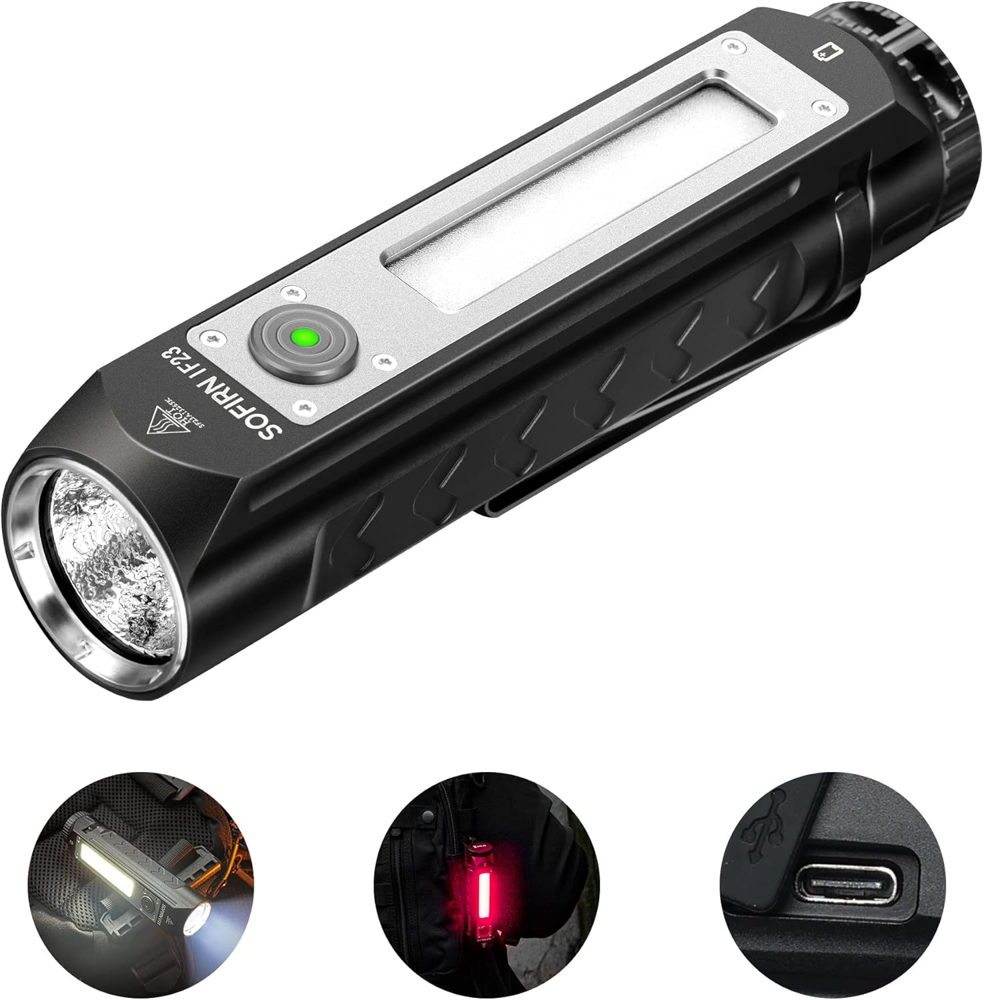

Це якась неймовірна вундервафля:

- заявлені 4000 люмен
- батарейка 21700 на **5000** mAh
- IPX8 waterproof
- магнітна жопа
- вміє бути павербанком
- дохульйон режимів роботи

Власне, цей ліхтарик - основна причина взагалі написання оцьої статті, і все що писалося до того було маленькою підводкою до кульмінації опупєя нашого апофеозу.

Це був перший у моєму житті ліхтарик, для якого мені знадобилася інструкція, і більше того - ту інструкцію доводиться перечитувати.

У нього всього одна кнопка, і при цьому:

- головний spotlight
- floodlight
- RGB light

і всі вони можуть працювати на декількох рівнях потужності, із декільками режимами мигання (strobe, SOS, beacon)
Це бісова стейт-машина із купою переходів між своїми станами! 
Single click, double click, press&hold from ON, press&hold from OFF, 3 clicks, 4 (FOUR!) clicks...
Ось картинка як ним користуватися із амазону:

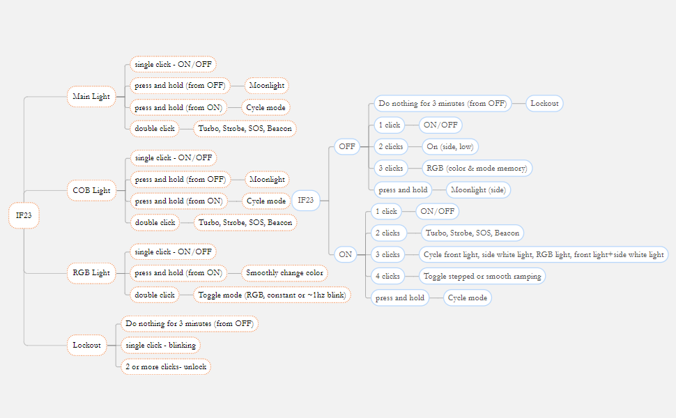

А ще до нього прикладається [інструкція](sofirn-if23-manual.pdf), в якій допитливий читач знайде такий пункт:
> **COLOR RESET**: When the flashlight is off and on stepped ramping mode, fast six clicks on the switch to reset color mode to red
light.

> [!CAUTION]
> ШІСТЬ.ФАКІНГ.КЛІКС.  

А вам слабо?

## To be continued...
