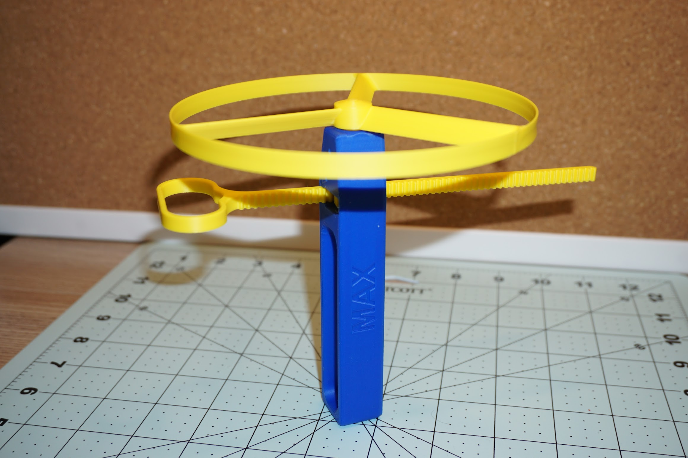

Підбірка того, що я друкував і друкую для використання або розваг
<!--more-->

## Strong Flying Propeller

[Strong Flying Propeller / Pull Copter (No Supports)](https://www.printables.com/model/227852-strong-flying-propeller-pull-copter-no-supports)

Це мабуть best of the best, надрукував гору варіантів і купу пропелерів, собі і друзям.

## Tiny Bins

[Tiny Bins - Efficient Small-Parts Storage [Parametric]](https://www.printables.com/model/701118-tiny-bins-efficient-small-parts-storage-parametric)

Шикарні маленькі коробочки для дрібʼязку, які можна поскладати у більші коробочки із кришками, а в свою чергу - у велику тримачку. Супер.  
Для цієї моделі я навіть "скастомайзив" перегородку, щоб поділити малесенькі біни на 4 частини - і вклеював ту перегородку у біни.

## Catch-All Trays

[Catch-All Trays / Desk organizer - stackable remix](https://www.printables.com/model/399667-catch-all-trays-desk-organizer-stackable-remix)

## BRIO/IKEA tracks

### set from [Michal Fanta](https://www.printables.com/@MichalFanta)

[Extended Set of Wooden Train Track with 50+ Unique Pieces](https://www.printables.com/model/117903-extended-set-of-wooden-train-track-with-50-unique)
### Brio Track connector
[Brio Track connector](https://www.printables.com/model/321447-brio-track-connector)

## Ping-Pong stuff

### ball holder (fragile)

[Ping Pong Ball Holder for underside of Joola Table](https://makerworld.com/en/models/166872)

### Ping Pong Paddles holder

[Compact Ping Pong Table Tennis Spool Holder 1.0](https://makerworld.com/en/models/561369#profileId-480751)

### Dispenser

[Ping Pong Ball ~ Table Tennis Ball Rack~ Dispenser](https://www.printables.com/model/87026-ping-pong-ball-table-tennis-ball-rack-dispenser)

## kitchen

https://www.printables.com/model/18012-utensil-holder

## Parts

- запасні ніжки до Greenmade 5-tier utility Rack: [Spare Feet for Utility Shelf](https://www.printables.com/model/830539-spare-feet-for-utility-shelf/files)

## TBC

TO BE CONTINUED...
