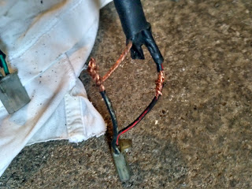
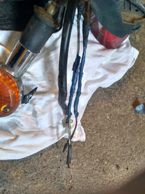
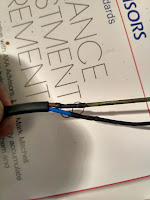
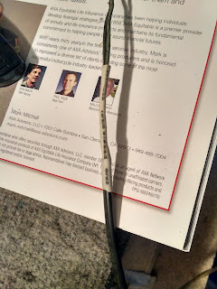
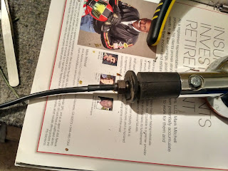
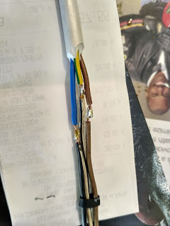
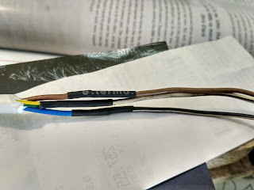
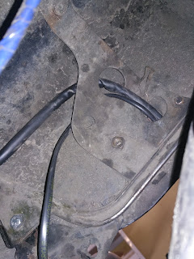
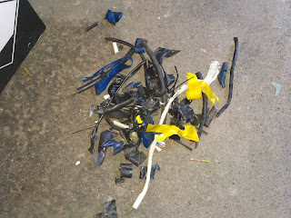
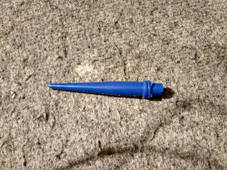

<!--more-->
## Було

## Стало

### Термоусадочка  

### Замінив провод

### Пайка на кабелі до стопу

### Знову термоусадочка

### Акуратно завів під крило (а не збоку)

### Сміття, що залишилось від розбору старих проводів:  

### Бонус - пісюн смурфа

(насправді засохший силікон, півтюбика пропало).

