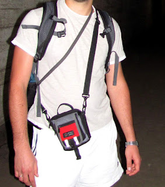
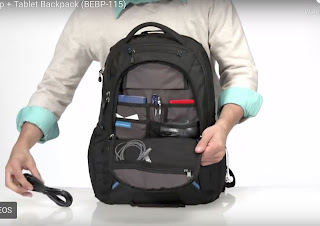

Я дуже полюбляю кишені і одяг із ними, водночас дуже давно не ношу у них нічого важливого: телефон у передній кишені заважає, у задній - губиться сам чи з допомогою добрих людей; варто лише залишити ключі або перепустку у кишені іншої куртки - і пока, доведеться повертатися.  
<!--more-->

## Сумочка

Тому я давно ходив із таким собі аналогом (чи прямою сестрою) борсетки, яка вміщає необхідний мінімум - гаманець, телефон, ключі. Це дозволяє незалежно від одягу - чи ти в майці і шортах на пляжі, чи в штанях і куртці на роботі - мати один модуль, який містить усе що потрібно, і виходячи із дому та маючи його із собою - ти впевнений, що нічого не забув.

Хоча вона не надто пасувала до "ділового" костюму - розлучатися навіть із потяганою я не хотів - три незалежні кишені  - одна паспорт/телефон, друга гаманець, третя менша під клапаном - ключі - такого набору і компактності не бачив більш ніде.

## Рюкзак

Головним рюкзаком у мене тривалий час був Terra Incognita Ventura - стандартний  22-літровий, купив через його перфоровану спину, яка мала зменшувати пітніння на велосипеді, але ніскільки не змешнувала. До того ж, рюкзак не надто пристосований до "офісного вжитку" - немає окремого відділу під ноут, та і кишень, відверто кажучи, замало.

Тому залишивши його для покатеньок та безпощадної тяганини на природу, для міського використання я собі придбав якийсь перший-ліпший **Case Logic**. Зараз вже складно знайти модель абощо (нагуглив [дуже схожий або той самий](https://www.caselogic.com/en-us/us/products/backpacks/case-logic-156-laptop-tablet-backpack-_-bebp_-_115_-_black) \[не той, але схоже його вдосконелена модель]), та заочний вибір виявився вдалим — за якісь 600 грн я отримав відділ для ноутбука, ще два великих відділи, дві бокові кишеньки і ще два мікрокарманчики, один з яких навіть не відразу знайшов. І ноутбук на роботу донести, і 3-4 пляшки пива із магазину прихватити - місце було. А по кишенькам розтикалися кабелі, флешечки, трошки інструментів - такий собі "Модуль №2", розширений набір. У тісняві мегаполісу по зрозумілим причинам носити гаманець та телефон/документи за спиною не хотілося - тому сумка та рюкзак надовго стали компаньонами.

