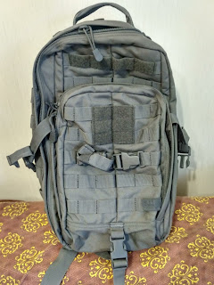
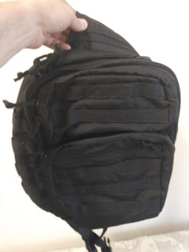
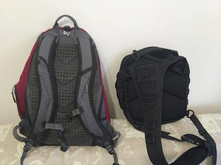
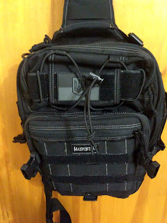
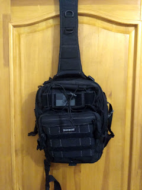

---
title: "Еволюція EDC. Частина 2."
date: "2019-08-20T20:02:00.001Z"
categories:
    - blog
tags:
    - imported
---

Із появою мотоцикла, у повсякденний набір, а вірніше \- в його організацію, довелося внести певні зміни: невеличка сумочка могла не витримати зустрічного вітру, а загублений навіть на 80 км/год телефон навряд чи вдасться навіть знайти, не те що зібрати.

Так у мене з'явилася додаткова сумка на стегно \- аналог маленької, але із надійнішим кріпленням \- та це знову призвело до перекладання гаманця і телефона із одного місця до іншого. До того ж, дволямковий рюкзак виявилося досить незручно одягати на куртку.

Таким чином я дійшов до ідеї знайти/обрати один рюкзак, щоб це був однолямковий і модульний. Очевидною здавалася думка подивитися у бік тактичного напрямку \- зі всіма їх MOLLE та широким асортиментом додаткових пристібних кишеньок/подсумків.

  

Вимоги були такі:

* поміщається 13" ноутбук
* одна лямка аби легко одягати та перевертати наперед \- на випадок громадського транспорту
* можливість причіпити/відчіпити додаткову маленьку щоденну сумочку із телефоном/гаманцем

  

  

Так у моїх руках з'явилися: 

  

[5\.11  RUSH MOAB](https://www.511tactical.com/rush-moab-10.html) у кольорі STORM \- досить цікавий рюкзак, із кількома кишенями на лямці та взагалі досить достойний (хоча і недешевий як для України). Практика використання показала два неочевидних недоліка:

1. головний і найбільший відділ, куди поміщався ноутбук, завеликий для ноута \- тобто це по суті просто найбільший відділ рюкзака. Ок, в ньому всередині є кишеня, яка може відділити ноут від решти цього відділу \- та все одно, все покладене туди виявляється безпосередньо поряд із ноутбуком, практично без ізоляції та захисту.
2. Одиночна лямка \- врізається в шию.

Виявляється, у світі однолямочних рюкзаків є два підходи: у одному лямка згори кріпиться посередині, що дозволяє знизу перестібати її наліво чи направо, залежно від того, лівша ви чи правша. У другому підході кріплення лямки згори вже "з коробки" розраховано на лівшу (чи правшу), зміщене до однієї зі сторін рюкзака, що робить його зручнішим для використання, та менш універсальним.

  

З огляду на це, мій наступний вибір був... ноунеймова недорога копія рюкзака від Maxpedition, яку робили десь у Запоріжжі і продавали через розетку.

  

  

На жаль, кращих фото я не знайшов, але тут трошки видно асиметрію у кріпленні лямки зверху, у широкій частині \- вона пришита зі зміщенням до лівого краю, а справа у тій же широкій частині анатомічна дуга для шиї. 

Що цікаво, після отримання рюкзака мене попросили про відгук \- і я написав у особисті повідомлення, що рюкзак ок, але ноут не поміщається та дизайн для правші. То ці святі люди попросили мене повернути цей рюкзак, а мені прислали натомість перешитий під лівшу і трошки збільшений, згідно моїх замірів! 

Мабуть єдиним мінусом цього рюкзака була дешевизна обраних матеріалів, бо він і сам коштував вп'ятеро дешевше за 5\.11 чи свого оригінального близнюка, про якого мова згодом. Тобто тканина досить цупка, але недостатньо тверда для тримання форми. Кишеньки спласкувалися і застібки\-блискавки було неможливо відкрити, не притримуючи рюкзак другою рукою \- бо блискавки тугі і тканина їм не противилася. 

До того ж на той час вже було видно проблему із пошуком сумісної маленької повсякденної сумочки \- тактичні пристібні кишеньки роблять для аптечок,  додаткових магазинів, гранат, документів \- але всі вони виявилися або завеликими, або замалими, із малою кількістю кишень та до того ж ажніяк не пристосовані для автономного носіння, відстібнуті від рюкзаку \- просто не мали нічого, крім MOLLE \- ніяких ручок чи ремінців.

  

Однак я вирішив все\-ж спробувати оригінал, з якого скопіювали вищезгаданий запорожці \- [Maxpedition Malaga Gearslinger](https://www.maxpedition.com/products/malaga-gearslinger). Ух, це був супер рюкзак !

  

Цупкий, чудові матеріали, компактний \- просто мрія!

Однак \- із вибором підходящого підсумка так і не склалося, та ще і він виявився із лагеря "центрально\-лямочних".... Це не так дошкуляло, як у випадку із 5\.11 \- можливо розміри самого рюкзака мають значення, можливо дизайн. Єдине, що мене бісило \- на деяких кишеньках блискавки\-застібки мали лише по одній собачці  (бігунку) замість двох,  тобто їх не можна було розстібати довільно зі зручної мені сторони. Притому копіювальники із Запоріжжя \- зробили по два бігунки скрізь!

Ну а вирішальною бідою стала саме компактність \- до ноута вже не можна було докласти великі навушники, навіть блок живлення із мишкою поміщалися із помітною напругою, а я відчуваю дискомпорт при напханому рюкзакові. Кишеньок теж виявилося замало для поєднання моїх офісних та "на всяк випадок" потреб.

  

Таким чином, перебравши пристойну кількість варіантів (бо я тут не описав ще декілька китайських однолямочників із Аліекспресу) \- я повернувся до старої перевіреної часом схеми \- сумочка через плече \+ дволямочний Кейз Лоджик, який хоча і став досить потріпаним із часом \- та вміщував все необхідне \- мультитул, мотузочку, ізолєнту \+ мав досить місця для ноутбука\-навушників\-зарядки\-мишки\-блокнота\-набору ручок/олівців, і ще залишалося місце для пляшечки пива. Дружина його трошки підшила (навіть декілька разів) і я щасливо проходив із ним ще пару років.

