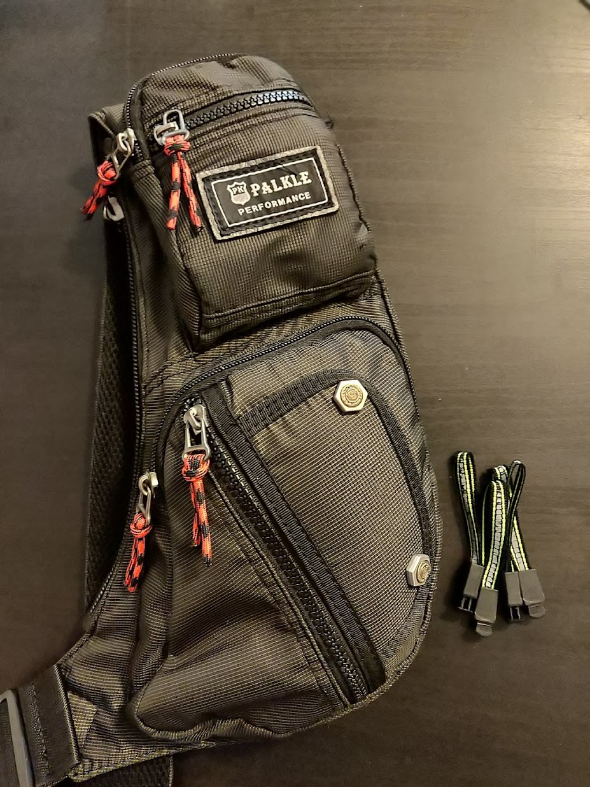

На жаль, ніщо не триває вічно - і мій щиро і довго любимий КейзЛоджік вже потроху здавав свої позиції - залізяччя  із кишень попротирало дірки, лямки порозтягувалися, спина потерлася і зачовгалася. Та і маленька черезплічна сумочка також втрачала зовнішній вигляд, а що найсумніше  - сучасні лопатотелефони перестали до неї поміщатися!
<!--more-->

Я пробував все. Я ходив із подарованими (і досить непоганими) рюкзаками (немає посилання, бо вони кастом-мейд для фірми), я купив декілька (4) маленьких сумки на Амазоні, я почав ходити в жилетці, складаючи в її кишені телефон.

## Ogio

Аж раптом, коли я вже змирився і свої пошуки припинив - мені пощастило аж двічі. Спершу у одному зовсім нерелевантному магазині мені до ока потрапив [OGIO Renegade](https://www.ogio.com/backpacks/renegade-rss-laptop-backpack/spr4704948.html), котрий мав конфігурацію кишень іще кращу, за КейсЛоджік - та на додачу іще декілька плюшок типу можливість надягти на ручку дорожньої валізи або жорстку кишеню для окулярів. Із магазину я вийшов із рюкзаком, і прийшовши додому -знову порозпихував по його чудовим кишенькам увесь той мотлох, що я звик носити із собою - мотузку, ізолєнту, викрутки, і те де, і те де.

## Слінг

Вдруге мені пощастило, коли я на Амазоні випадково натрапив на отакий [невеличкий слінг](https://www.amazon.com/gp/product/B07GWX7PXS/ref=ppx_yo_dt_b_asin_title_o06_s02?ie=UTF8&psc=1): до нього чудово поміщаються:

* ключі від машини
* ключі від мотоцикла
* радіобрелок від гаража
* ключі від квартири + [Leatherman Style CS](https://www.leatherman.com/style-cs-24.html) як брелок
* гаманець
* документи особи (паспорт - навіть два) [за потреби]
* документи на транспорт
* навушники
* павербанк + пара шнурків [за потреби]
* запальничка

і при цьому він досить компактний та може бути під, наприклад, курткою - якщо його одягти наперед. Взагалі, можливість одягти наперед та назад - це кіллер-фіча однолямкових, як ми пам'ятаємо. Я лише провів невеличкий апгрейд мотузок на замочках, замінивши їх на більш патріотичні:

Тож рюкзак зараз переважно залишається вдома - настільки вдалим і містким (та водночас компактним) виявився цей  Palkle.

Враховуючи, що ключ від авто безконтактний - його діставати не треба взагалі, і він чудово почувається у невеличкій кишеньці. Ключ від будинку також безконтактний, та його потрібно притуляти до датчика, тож поклавши у правильну (передню нижню) кишеню - і тепер коли сумочка спереду на пузі - це можна робити навіть без рукю
