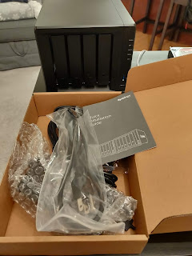
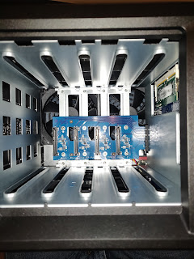
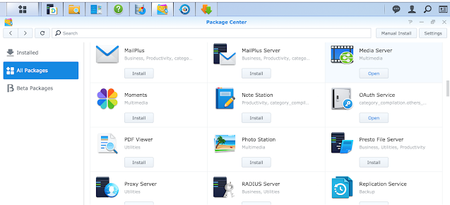

Сьогодні в числі цифрових жителів нашої оселі з'явилася ще одна (чергова) коробочка. Насправді, завдяки чорній п'ятниці (про яку взагалі варто написати окремо) - їх з'явилося декілька, одна за одною, але саме ця поки що найбагатообіцяючиша та дає найбільше можливостей погратися.  
<!--more-->
Отже, прошу любити та жалувати - маленький домашній NAS [Synology DS918](https://www.synology.com/en-us/products/DS918+).

Поставив туди один із двох куплених дисків - щоб отримати досвід розширення на майбутне, поки ще нічого не налаштував і не жалко якщо що, все дропнути і викинути.

Виявляється, у цієї штуки дуже багатий "внутрішній світ" - усередині веб-інтерфейсу можна встановити купу всяких штук просто клікаючи мишкою - як наприклад Gitlab сервер або свій власний Дропбокс чи ГуглДрайв.

Що цікаво, жодна із тих можливостей не дає мені змоги вирішити просту задачу - за розкладом скачувати щось із віддаленого сервера по простому rsync, тому озброївшись ансіблом, взявся за молоток......

І лише через 45 хвилин гугльожа, спроб та помилок вдалося причепити ансібл до тої коробочки - бо бачте то домашніх каталогів нема, то в конфізі sshd  не налаштовано вхід по ключу, то права на домашню папку якісь виставляються химерні....

Але, хвала гуглу та [superuser.com](https://superuser.com/) - нарешті підчепився.  Тепер час писати плейбуку....

Автоматизація, хай йому грець - я би вже тричі зробив все, що треба, руками - але ж хочеться правильно та красиво..... Тому поки у Вілларібо все настроїли і насолоджуються результатом, у Вілабаджо із крвавими сльозами впроваджують найкращі практики домашнього девопс....

