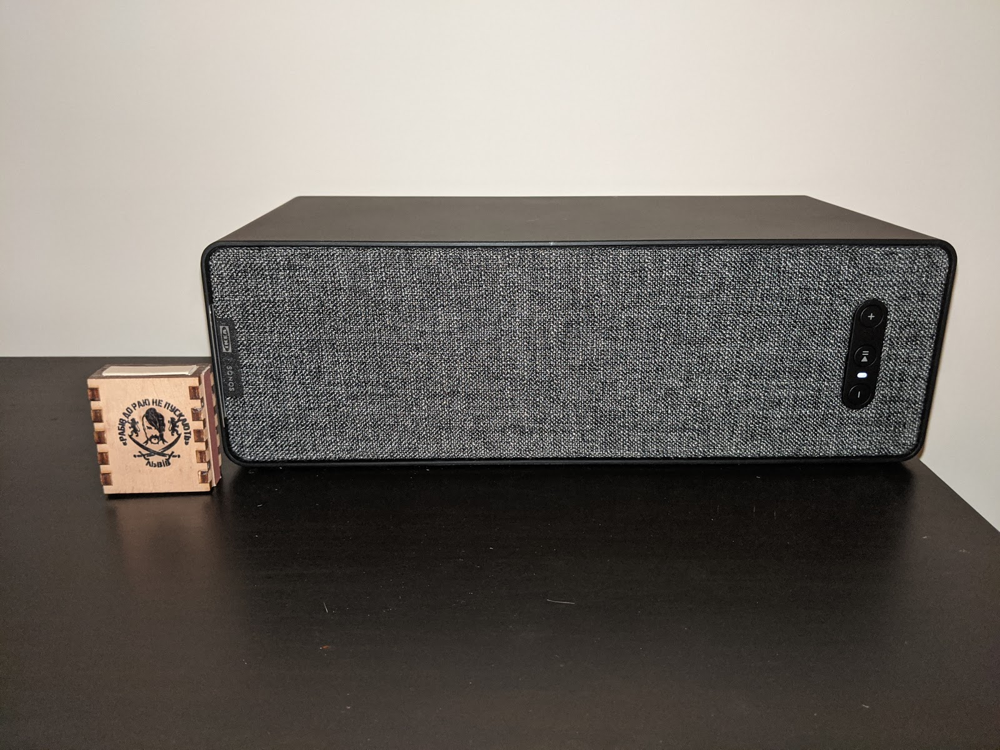

Нещодавно моя домашня мережа (про яку я можливо напишу якось детальніше окремо) поповнилася іще декількома жителями (трьома чи шістьма, ще сам не зрозумів).
<!--more-->
Почалося все із одного Сімфоніска, а вірніше - почалося все ще із Бобука. Цей ведучий РадіоТ так щиро та старанно нахвалював колонки Sonos (із досить преміальним цінником), що коли я побачив у Ікеї за якихось майже півціни спільний продукт Symfonisk (колонка Сонос із дизайном/брендом Ікеї) - я вирішив, що пора брать.

Сталося це мабуть ще минулого року, і колонка виявилася чудовою. Звук - дуже добрий як на невеликий розмір, включається в розетку, має Ethernet, але також за 2 хвилини підключається (за допомогою апплікухи для Айос/Андроїд) через wi-fi (щоправда, вміє тільки 2Ггц).

Для сьогоденних хіпсторів колонка вміє підключити до себе силу силенну всіляких онлайн-стрімінгових сервісів (я не шуткую, добрих кілька десятків) - і відомі Spotify, Pandora, Youtube Music, Amazon Muzic, Sound Cloud і всілякі такі, що я ніколи не чув - як от Calm Radio або TuneIn. В останньому, до речі, є і українські радіостанції типу Радіо Рокс.

Але для старих груш типу мене приємним сюрпризом виявилося те, що колонка вміє проіндексувати Samba шару (ну мережеву папку, ми ж тут всі ойтішники наче :-)  Проіндексувати і потім грати самостійно, не потребуючи нічого. Це просто жир! Я потім подивився як її розбирали на ютубі - то там у цій колонці 1Ггц 2-ядерний процесор і 256Мб оперативки - та у мене перший комп'ютер був гіршим, і другий і можливо навіть третій!

За допомогою жінки знайшов для неї місце - і приєднався до палких прихильників Sonos, став безкоштовним амбасадором.

Дизайн досить невибагливий, (коробочка сірників для масштабу), але звучить ця цеглинка вельми і вельми приємно.  Ну принаймні як на мій немузичний слух, бо окрім радянських колонок та навушників Koss Porta Pro я в житті мало що чув)
