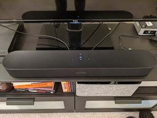
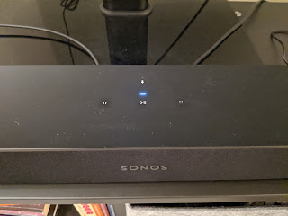

Після того, як музика в нашому домі зазвучала по новому - дуже яскраво стало помітно, який же гівняний звук у плаского телевізора. Воно то ясно, що взятися хорошому там нізвідки, але раніше принаймні не було із чим порівнювати.
<!--more-->
Тому я почав приглядатися - дуже недовго, і обрав одразу саундбар **Sonos Beam**. Обрати було легко - я хотів саме Sonos заради інтеграції із існуючим Сімфоніском, але як я вже згадував, цінник у Соноса преміальний - тому в мене не було іншого вибору, окрім як зупинитися на самому дешевому. І то я ще чекав розпродажу на Чорну п'ятницю, аби іще хоч трошечки заощадити.

Із саундбаром телевізор засяяв новими фарбами заграв новими звуками. Настроюється все так же просто - апплікуха в телефоні каже "Я тут бачу колонку, ану натисни на ній кнопку" - натискаєш, щоб підтвердити що колонка дійсно твоя, воно робить якусь внутрішню магію  і бац - уже дві колонки, і всі ті стотищмільйонів стрімінгових серівсів і оффлайнова фонотека тепер можуть грати на дві колонки. По повітрю.

До телевізора він підключається HDMI  кабелем у спецвхід зі зворотнім зв'язком - тобто весь звук, який на телевізон приходить - з самого телевізора чи із іншого HDMI-входу - йде на саундбар, і гучність регулюється на телевізорі. Красота!

Більш того, звук із телевізора може йти також і на друго колонку в системі - як налаштуєш.

Але це звучить якраз неприємно - коли і від телевізора, і зліва говорить те ж саме кіно. Тому для фільмів - саундбар, для музики - обидві.

Це вже продукт без Ікеї, але і серйозніший - має вбудовані мікрофони, тому окрім говорити може ще і слухати через Гугл Ассістант або Амазон Алексу, має зверху сенсорну панель (вірніше, просто тач-ділянку) - гучність, пауза, перемотка. Панель (і мікрофон) вимикається, на щастя, бо реагує не тільки на людські пальці, а і на кошачі лапи.

Такий передноворічйний різдвяний подарунок спричинив іще одну покупку  - рідні ніжки телевізора були надто низенькими, меншими за саундбар, і він собою закривав інфрачервоний приймач для пульта. А ззаду телевізора він ну ажніяк не влаштовував моє почуття прекрасного - і не тільки тому, що хотілося похвастатися гостям (яких все одно не буває)), за яку мажорну колонку я виплачую кредит,  а і тому що хотілося користуватися сенсорною панелькою - а кішки ще тоді не було -  та і взагалі негарно. Тому купив іще за півціни телевізора центральну ногу із налаштовуваною висотою аби підняти його над колоночкою. На які тільки жертви люди не підуть заради музики...
