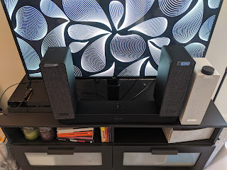
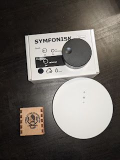

Отже, проблему із телевізором (і звучанням приставки заодно) було вирішено ціною втрат крові і нервів у боротьбі із жадібністю успішно. Здавалося, все чудово, однак інфекція вже глибоко пустила свої корені у організм - і коли на кухню виходиш то телевізора не чути, і у ванній би полежати під стрім улюбленого подкасту, і взагалі, я бачив Ікея ще пропонує пульти дистанційного керування звуком.....
<!--more-->
А тут так доречно нагрянув карантин і довелося робити замовлення невеличких штучок із Ікеї. Сімейна нарада, втомлена моїм багатомісячним скиглінням, нарешті дала добро, і ціна замовлення збільшилася всемеро втричі.

На жаль, на всі забаганки мені не вистачило наснаги і грошей, тому довелося обмежитися мінімальним набором - іще один Symfonisk у вітальню/кухню - для стерео, іще один - біленький - у спальню - слухати там що попадеться (а ще вони вміють бути будильником і грати що налаштуєш за розкладом, чи радіо, чи музику, чи подкаст, чи бібікання), ну і пульт жеж дистанційного керування, хай йому грець - бо не завжди зручно бігти до колонки або лізти тикати в телефон, особливо коли щось на кухні жадібно поїдаєш вишукано смажиш.

Отже, саундбар обзавівся двома сателітами. Звичайно, вони стоятимуть не тут, а висітимуть обабіч дивану - і в цьому величезний плюс безпровідних колонок - ніяких обмежень, аби лише діставало до розетки живлення. Долби сурраундом!

Біленький буде поличкою у спальні - і будильником, і ще виявився неочікуваний бонус - він чудово грає на балкон через відчинене вікно. 

А кругленька шайба на білій колонці - ото і є безпровідний пульт-крутилка. Може керувати будь-якою колонкою (або їх групою) - гучність і кліком пауза, дабл/тріпл-кліком - попередній-наступний трек. На додачу воно іще і магнітне на зворотній стороні (та в комплекті йде підходяща залізячка і двосторонній скотч), тому перший відправився прямо на холодильник.

Єдина ложка смальцю у цій діжці скотчу - ці крутілки не працюють із колонками. Ну вірніше, вони працюють, але для того потрібно купити Ікеївський хаб для розумного дому, включити його і вже в ньому крутилки підключити до колонок. Тобто це таке собі мабуть рішення зовнішнє і той хаб якось отримує сигнали від пультів і вже сам їх проксіює до колонок, але блін довелося витратити окрім грошей іще і порт у роутері та десь роздобути живлення до тої хабні.

Кругла біла - то і є хаб, і до нього ще треба поставити спеціальну ікеївську програму для налаштування. Це хазяйство взагалі для розумного дому, тому там ще керування лампочками та жалюзепідйомниками, та на сьогодні треба тільки звук (хоча автоматично відкривати жалюзі разом із будильником - це було би чудово). На щастя, у роутері якраз залишився останній вільний порт (боже,  а в мене ж майже все без кабелю....) і ше цей же роутер завдяки своєму ЮСБ-порту став і кормящою мамкою джерелом живлення для хабу - йому треба 5в і в комплекті кабель та адаптер, але в мене банально немає місць у розетках (і подовжувачах) — вкрай невдала конфігурація у цій кімнаті, викручуюся як можу.

Ну і ці крутілочки також нехитрими маніпуляціями, слідуючи інструкціям програми, підключаються до хабу, а потім в програмі - до потрібної колонки. Працює!

Я тільки не зрозумів, як вони підключаються - в компплекті батарейка CR2030, і я сумніваюся, що її вистачить на WiFi та ще і на заявлений рік-два, тому думаю там або блютус, або якась йому альтернатива смарт-хоумна. Крутилки взяв три - одну для спальні, і дві - керувати системою як із кухні, так і із дивану. В будь-якому випадку, число айпішників в мережі зросло на 2 колонки + хаб, ну а девайсів у цілому - на 6.  У планах (можливо дуже далеких) - налаштувати моніторинг усього, що має айпі, та знімати із роутера статистику, скільки внутрішнього трафіку хто споживає - цікаво, наскільки всі ці колонки-телефони-ноутбуки завантажують пропускну здатність вайфаю і чи не пора якийсь робити апгрейд.

Апгрейд - бо тепер же для всих цих колонок треба **сабвуфер**....  
