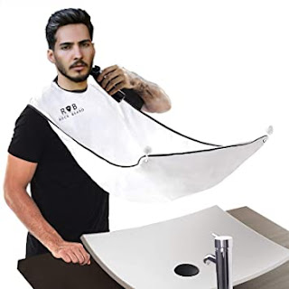

Десь років із 4-5 тому я купив на аліекспресі отакий чудесний фартушок для джентельменів, котрі віддають перевагу власному піклуванню про бороду:
<!--more-->

Копійчана річ - шмат гладенької синтетики із липучкою навколо шиї та двома гачками-присосками на дзеркало зробив підрізання бороди іще легшим, бо ж не треба виловлювати шерсть із умивальника чи де ви там її розкидували до цього.

Сьогодні, коли цирюльні зачинено і джентельмени переходять на самозабезпечення - додайте до свого триммера ще отакий аксесуар, не пожалкуєте. На жаль, посилання на той, що купував я  протухло (і у моєї версії не дуже надійні присоски, одна постійно відвалюється), та такі штуки легко знаходяться на алі за ключовими словами "man trimming apron".
