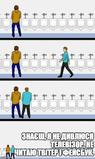

Перечитував свій власний блог, та читаючи малочисельні коменти, помітив - що один із доменів друзів, а саме - [tsybulko.org](http://www.tsybulko.org/)- пропав. Шкода.
<!--more-->

Та точно знаю, що із френдом все гаразд - переключився на фейсбук, який все більше вбиває стенделоун блоги. А я ж навпаки, помітивши, як мій паттерн використання фейсбуку змістився у бік читання непотрібного мені шлаку, вирішив на додачу до social distancing запровадити іще і соціальний карантин. Фейсбук і так вже єдина соціалка у моєму побуті - бо важко назвати соціальною мережею Linkedin або Twitter - у перший я і так заходив раз на місяць,  а у Тві для мене немає ніякої соціальної складової — жодної людини там не знаю особисто.

Два тижні назад завершилась перша фаза експерименту - заглянув у ФБ після місячного карантину, і задоволений результатами - повернувся до його продовження.

12 візитів до фейсбуку на рік - хіба не погана мета? Врешті решт, навіть блог трошки ожив, не кажучи вже про вивільнення часу для інших цікавих та корисних активностей. Сподіваюся, далі буде тільки краще.

