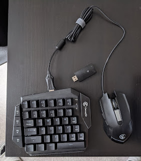
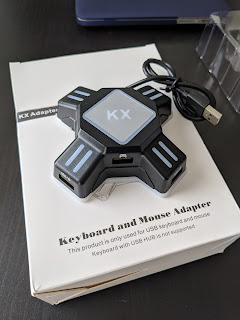

Скількись там часу назад мої "любі друзі" вмовили мене на покупку **плойки**, вона ж PlayStation4. Основним аргументом за був вихід  гри Borderlands 3, яку моє існуюче залізо не тягнуло ажніяк. Зваживши за і проти - а саме, $800 за ігровий ПК проти $100 за ігрову приставку (бу) - я обрав друге, скатався за нею із добру сотню кілометрів, і отримав власне приставку, пару джойстиків (в оригіналі один), зарядку станцію для джойстиків і диск **Mortal Kombat XL**!!  
<!--more-->
Однак неприємним сюрпризом було те, що на відміну від рубілова у Морталі, у шутери від першої особи гратися на джойстиках не так зручно чи звично. Товариші переконували, що це  справа звички і скоро пройде і взагалі все напрацюється, та я все одно страждав за мишкою.

Бездротовий комплект Logitech приставка не бачила, рівно як і провідну мишу. Вірніше, приставка бачила і клавіатурою можна було лазити по її меню, але у іграх - дзузьки.

Та я не мав наміру здаватися - бо ж я хотів отримувати задоволення, а не "вихід із зони комфорту", тому гугльож показав, що вихід із ситуації є, апаратним способом. А саме - купується контролер, що підключається до джойстика з одного боку та мишки/клавіатури із іншого і передає рухи звичних користувачу ПК маніпуляторів типу "миша" і "клава" до приставки як ніби то вони від джойстика.

Рекомендований кращими знавцями був такий собі [XIM APEX за $125](https://www.amazon.com/XIM-APEX-Keyboard-Mouse-Adapter/dp/B079SS1CCR), як найменш глючне рішення. Мені ціна показалася зависокою (хоча я і розумів, що заощадив на приставці і психологічно був готовий). Пошукавши по амазону, я обрав два інших із думкою спробувати і якийсь один повернути.

[Перший комплект](https://www.amazon.com/gp/product/B07N2SSWHV) включав додатково власну мишку і півклавіатури. Тому за $100 виглядав привабливіше конкурента

[Другий](https://www.amazon.com/gp/product/B07ZHLF5L6) - просто контролер за $20

Якось  так вийшло, що перший виявився досить пристойним, хоча і не ідеальним - бувають затримки і підглюки. Та я списую це на приставку, бо підглюки бувають і із підключеними по USB навушниками.

А головне, ці клавіатура і мишка безпровідні і можна не прив'язуватися шнурком до приставки, а сидіти де зручно та цілитися у супротивників, як звик.

Джойстики - морталам, мишки - FPS!
