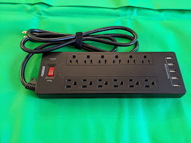
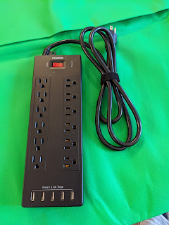
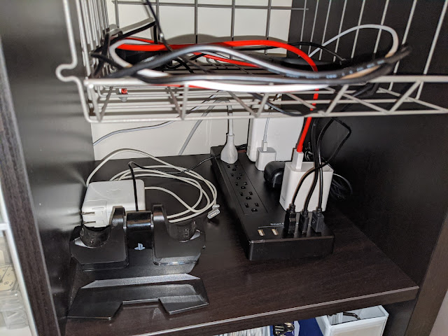

---
title: "And one ring to rule them all!"
date: "2020-05-09T13:00:00Z"
categories:
    - blog
tags:
    - imported
---

Відразу декілька іграшечок доїхало сьогодні \- перевагу в логістиці мають харчі і туалетний папір, а не залізячки, тому чекати довелося довго. Однак оця цяцька на 12 розеток \+ 5 USB має суттєво зменшити ентропію мого шкафчика. Життя в 21 сторіччі вимагає постійної зарядки, і не лише фізичних вправ щоб не росло пузо, а і електричної.   
  
Прокинувся, зарядив телефон, зарядив годинник, зарядив повербанк, зарядив ноутбук, зарядив робочий ноутбук, зарядив фінтес\-браслет, зарядив павербанк дружини, зарядив навушники, зарядив джойстики, зарядив мишку..... Що забув? О, зарядить робочий телефон! Трясця, а перший телефон вже сів!  
Жарти жартами, а розеток дійсно треба багато, і переважно щоб увіткнути туди USB, тому вуаля:  
Не додумався сфоткати як було до, та і результат цей іще не фінальний \- іще одна цяцька досі їде. Але схоже, в цього монстра можна підключити все вищеперераховане, а на додачу зарядку зубних щіток, акумуляторів до фотоапарата, акумуляторів до дрона, годинник..... Начебто я всеж\-таки щось забув....  
На фото \- один кубік ікеївскої полички KALLAX із сумісною корзинкою. Внизу зарядки, в корзинці \- споживачі. Красота, вентиляція, зручність.  
  

