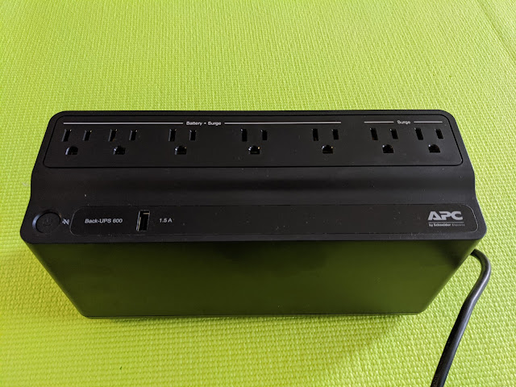
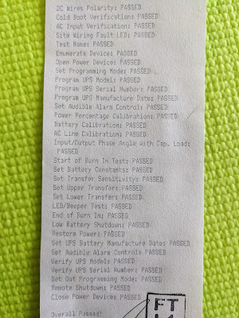
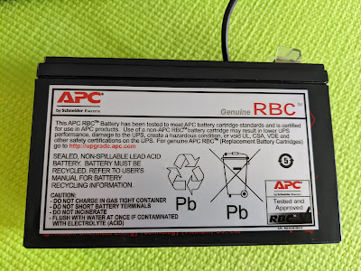
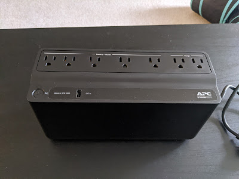

А хто це у нас тут такий гарненький? А це мій перший UPS! Живучи вже більше десятка років на ноутбуках, я ніколи не відчував у них потреби - якщо світло пропадає у будинку, то скоріше за все і обладнання провайдера відключиться, а якщо пробки - то роутер перезавантажиться за кілька хвилин, не страшно.

<!--more-->
Однак маючи знову справу із жорсткими дисками та Synology NAS, у якого звісно що немає власного акумулятора, купив після першого ж мигання світла. Дув сильний вітер, і знаючи як тут люблять тягати кабелі по деревах - наступного вітру я вирішив не чекати.

Приємно було бачити звіт про проходження тестів, дбайливо приклеєний малярною стрічкою до корпусу юпіески.

Батарейка невеличка, та вимкнутися насові вистачить, а роутер, якщо буде потрібно  - багато не їсть. На коробці заявлено, що пара модем+роутер можуть працювати від цього блочку 4.6 години. Ну, APC по моєму досвіду працювали на совість. Побачимо з часом.

ПС: чорна техніка відмінно суміщається із чорними меблями, але жахливо фоткається )))

