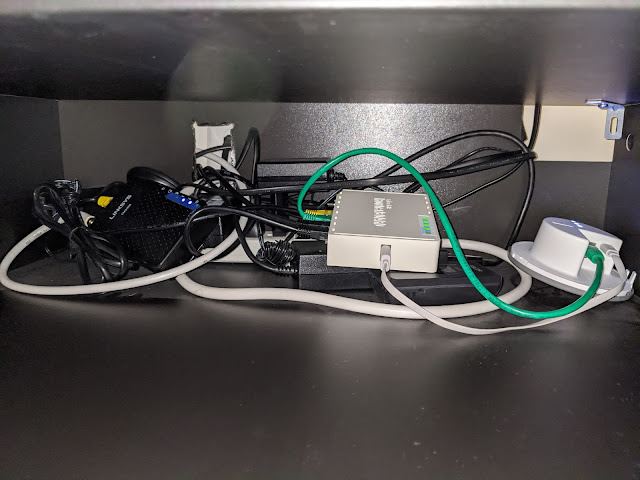
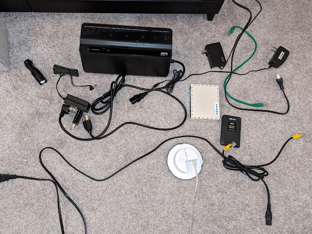
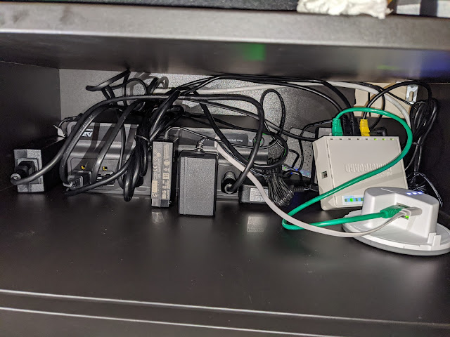

Я ж не буду підключати до UPS тільки один NAS, це було би нечесно і нерозумно.
<!--more-->
Тому доведеться його (UPS) запихати у осередок моєї диджіталізації - а саме у невеличку поличку підтелевізорної тубми, де живе все - кабельний модем, роутер, роутер IKEA для їх розумного дому, блок живлення для  Synology (здоровецький), блок живлення для Intel NUC, та купа кабелів між ними. Це все хозяйство закрите від кота, аби не ліз на тепло, а відтак без достатньої вентиляції іще дужче гріється - тому там лежить ще і безпровідний термоволого датчик, від якого мене цікавить тільки температура (32 градуси в середньому).До речі, сьогоднішній сетап виявиться можливим тільки через провал попереднього проекту із перенесенням Synology у комірчину (не знайшов відповідний розетці кабель) - якби розніс сервер і інше барахло по різним кімнатам, то однією юпіескою не обійшовся би.

В глибині мотлоху видно білий подовжувач на 6 розеток, у UPS - сім портів + додатково USB, що дуже доречно - зараз ікеївський хаб живиться від порта мікротіка, і слава аллаху той порт у мікротіка є  - бо впхати блок живлення  в розетки вже нікуди. В цій кімнаті якісь дуже заощадили і в тому місці, де виходить телевізійний кабель і нормальні люди ставлять мінімум дві парні розетки, поставили лиш одну. Телевізор, подовжувач - і йок. Але зараз усе стане краще!

## Було

Витяг менше половини, щоб зацінити масштаб трагедії

## Стало

Після реконфігурації показання датчика виросли до 37... Щоправда, я його і поставив між найгарячішими парубками - модем Lynksys гріється на всі гроші! Поспостерігаю пару днів, та сподіваюся - не ростиме, бо розбирати відносно вдалу реалізацію не хочеться, а вентиляцію покращувати досить складно, хіба городити що примусове - звільнився ж юсб порт на Мікротіку! :-)
