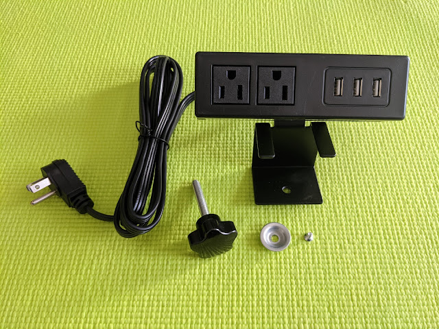
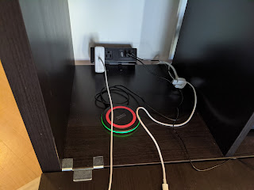
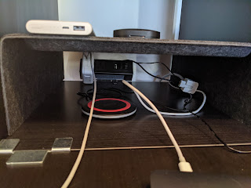
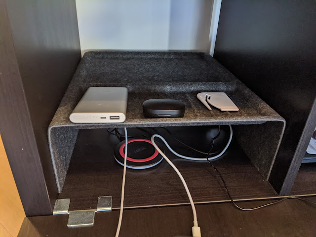

Очікувано, що 12 розеток не вистачило би (вірніше, не все можна підключити у єдиному місці, бува трошки не вистачає довжини провода), тому навздогін доїхав фінальний (на сьогодні) учасник - отакий навісний блок розеток. Бувають різні конфігурації, я взяв покомпактніший із максимумом USB.

<!--more-->

Потрібно було підключити два споживачі - блок живлення для ноутбука та настільну лампу - сам дуже здивувався, коли вона прийшла із USB-роз'ємом замість звичайної вилки. Можливо, адаптер у комплекті був, але якщо можна без нього - то ще краще! Ну і сховати все це кабельне господарство потрібно непомітно - задля естетики та вберегти від кота. Отже, монтуємо подалі, між шафкою і стіною, на рівні столу.

У фінальній версії ніщо не нагадує про прихований прилад, і там ще є резерви для парочки підключень. Красота!

