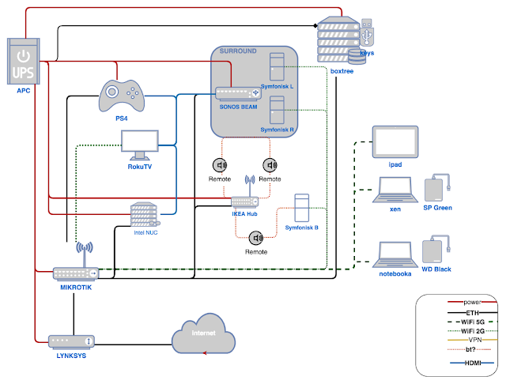

Робота із дому показала, що інколи вайфай буває нестабільним - поки неясно, чи це мікрохвильова піч, чи ще щось. Тому буду пробувати підключити ноутбук старим добрим кабелем.Одна заковика - у мого роутера лише 5 Ethernet портів, і всі 5 зараз зайняті. Вирішив проблемою зайнятися системно - намалювати спочатку що і як, та покумекати - куди що підключити, чи брати PoE свіч, чи простий, чи заощадити і взяти FastEthernet, чи все ж таки гігабітний... Різниця від $10 за найпростіший 100мбіт до $60 за гігабітний із PoE. А поки процес обмірковування триває - отак виглядає простенька схемка домашньої мережі. Звісно, іще декілька компонентів на ній не вистачає, буду потрошку домальовувати....

