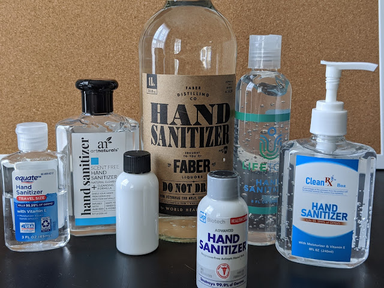
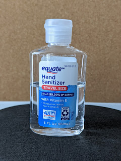
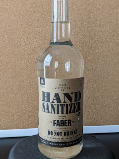
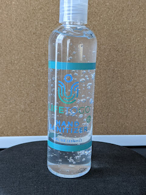
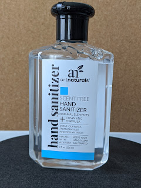
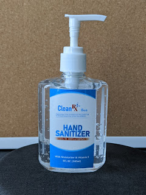
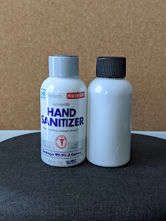

Сьогодні в магазині побачив розмаїття дезинфектантів для рук - схоже, паніка скінчилася, ну і виробничі потужності - якісь створилися, якісь перелаштувалися.
<!--more-->

Оця маленька пляшечка каталася у машині із вже забутих до-пандемічних часів, на випадок як доведеться десь скористатися публічним туалетом, абощо. Коли в паніці із прилавків розмели усе - вона (разом із парою пляшок спирту, що був придбаний переважно із очищувальною метою - наприклад, відтерти клей, що залишився на предметі від цінника) - довго були єдиним засобом дезинфекції за межами доступності мила.

Першою знахідкою стала ось ця продукція місцевих "самогонщиків" - друзі підказали, в якому магазині продають розбавлений гліцерином і ще якоюсь байдою восьмидесяти(!)градусний спиртяку. $10 за літр, досить непогано, хоча і на жаль, не годиться для моїх хімічних потреб. Але горить. І рідкий - для рук не так зручно, як більш густі аналоги.

Made in USA - гордо написано на цій маленькій пляшечці. Пузирки надають привабливості і свіжості! (свіжості дезинфектанту, Карл! що ти верзеш...)  Ну і в нього найбільша концентрація із портативних - 70%  
  

Теж непоганий, густий - але вже мейд ін чайна і 63%  
  

Пляшечка із дозатором відправилася у двері авто - зручно, компактно, доступно.  
  

Ну і найбільше розчарування із усіх покупок - тупо пляшки із гвинтовою пробкою, всередині рідкий 63% спирт. Ані дозатора, ані густоти, щоб відкрити - треба здерти плівку, після чого пляшечка стає без опізнавальних знаків. Не купуйте, кака. Найкомпактніше, і водночас - абсолютно безкорисне.  

