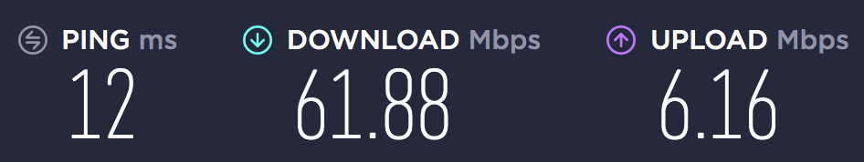

за оце ось - 40 доларів на місяць впродовж 12 місяців. через рік буде $60/місяць.  
 Сапожники без сапог....
<!--more-->

Окрема, довга і сумна історія, як я майже тиждень намагався цей інтернет підключити, висів по кілька годин у чаті, потім як чат зламався - на фейсбуці, потім 40 хвилин на телефоні і знову на фейсбуці. Але врешті підключив, заощадивши $60 на візиті "спеціаліста"....

----

Знайшов цей позаминулорічний пост у чорновиках, і картинка, яка мала бути - вже втратилася, на жаль. Однак там було щось чи 15 чи 20 мбіт/с. З того часу змінився і провайдер, і місце, тільки залізо не змінилося. На новому місці я не став витрачати час та нерви (ну і відверто кажучи, новий провайдер не пропонував опції самопідключення), тому заплатив $60 за установку.Ну і свіжий спідтест виглядає отак:

і коштує всього лише $48.49 на місяць...
