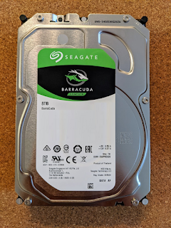

Подумав я і вирішив не чекати ані чорних п'ятниць, ані поки місце скінчиться досрочно. І з метою збільшення diversity всередині свого NAS, до двох червоних WD дисків додався ще один зелений Seagate.
<!--more-->

Настройка у Synology дуже проста, практично для домохозяйок. Можна розширити існуючий пул, але зважаючи на те, що диск все-таки десктопний, а не NAS/сервер (що дає надію на підвищену надійність), вирішив виділити його окремо, і розташувати там щось....що не потребує зеркалювання на кілька дисків.

Зрозуміло, що всі ці сторадж пули і вольюми мапляться врешті на LVM, але так приємно не думати про це і не займатися ручним колупанням. Включив, поклацав, працює - здрастуй, старість )))

