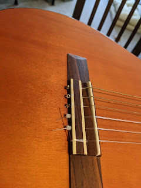
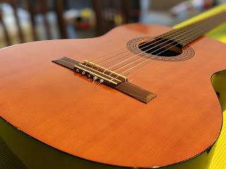
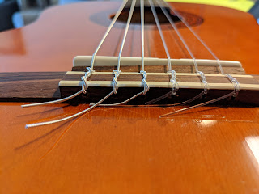

Перша власноручна заміни струн у моєму житті. Перша струна (як завжди) лопнула, однак гітара в той момент висіла на стіні, а нас взагалі вдома не було. Підозрюю, що кішка могла допомогти, однак доказів немає.  
<!--more-->
## Було

## Стало

  

Що там стояло - невідомо, поставив комплект Yamaha NS 110 за $13 та замовив ще парочку комплектів попростіше на майбутнє. Звісно, поки що тягнуться всі вузли та обмотки, сподіваюся, що зробив усе правильно і перемотувати не доведеться.

