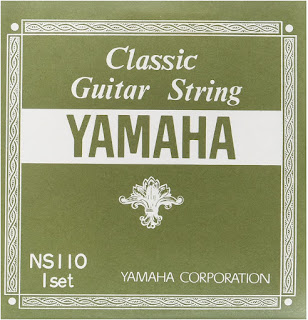

---
title: "Практика струн"
date: "2020-07-11T19:58:00.001Z"
categories:
    - blog
tags:
    - imported
---

Перша власноручна заміни струн у моєму житті. Перша струна (як завжди) лопнула, однак гітара в той момент висіла на стіні, а нас взагалі вдома не було. Підозрюю, що кішка могла допомогти, однак доказів немає.  
Було:  
  
Стало  
  
  
Що там стояло \- невідомо, поставив комплект Yamaha NS 110 за $13 та замовив ще парочку комплектів попростіше на майбутнє. Звісно, поки що тягнуться всі вузли та обмотки, сподіваюся, що зробив усе правильно і перемотувати не доведеться.  

