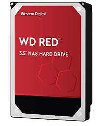
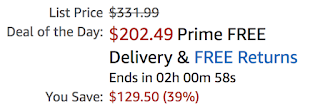
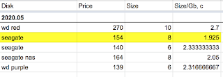
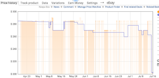

Налєтай, падєшевєло! - ніби кричав мені емейл від Амазона про 
грандіозний розпродаж всякого барахла від WD та SunDisk.
<!--more-->

У тебе всього дві години, щасливчику, аби купити цей чудовий 10-терабайтний диск із казковою знижкою у 40%! Та колись іще давно я підбирав собі стартовий комплект у NAS і економно вираховував, а які ж саме диски дають найбільш вигідне співвідношення ціна/гб при їх. Висновок зробив, а табличка залишилася і продовжилася - не так давно знову її доповнював, вибираючи черговий диск у Synology.Отам я і побачив, що іще недавно цей диск коштував $270, а аж ніяк не заявлені $331.99.  
  

Так, сьогоднішня ціна у $202 - приємна, безсумнівно. Але робимо висновки про довіру торгашам і маркетингові вудки із закресленими цифрами.  
  
