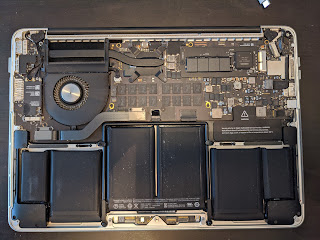
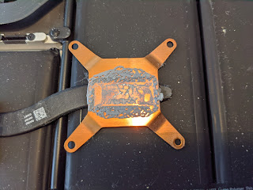
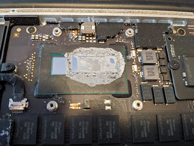
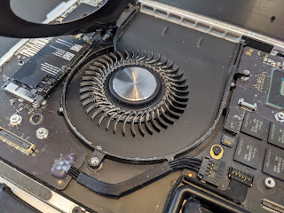

Ось так виглядають нутрощі шестирічного лептопу  
<!--more-->
  
Не знаю, чи обслуговувався він колись чи ні, але гудіти останнім часом почав часто (а от температурку я поміряти забув). Видно, що старенька термопаста вже підсохла.  
  
  

Цікава конструкція кулера, як заднє колесо у БМВ - на одному тільки боку кріплення осі.  
  
Хто закручував/відкручував 10 гвинтиків зовнішньої кришки три рази - той я. Спочатку забув наліпити наліпку із роз'єма до акумулятора, а потім власне лазив підключати сам акумулятор - не дотиснув із першого разу роз'єм, то ноут його не бачив, хоча справно працював від мережі.  
Старенька КПТ-8 (доставлена через E-bay аж із Румунії!) не підвела, і тепер тиш, гладь та холодна благодать. Вже розглядаючи фотки помітив, що менший кристал (відео?), котрий безпосередньо мідного радіатора не торкається, не був намазаний, а я трошки і туди гірку навозякав. Ну буде що витерти наступного разу, покищо наче політ нормальний.
