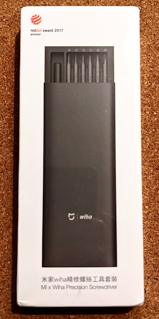
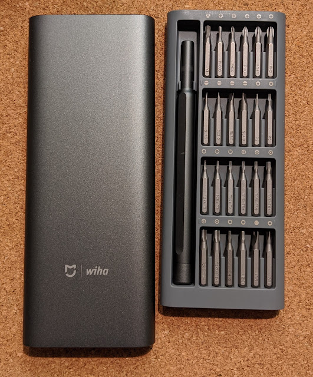
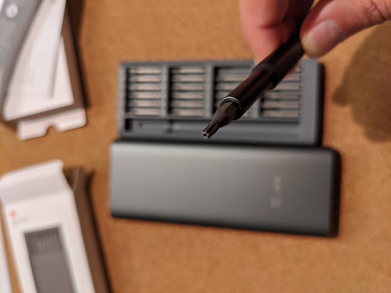
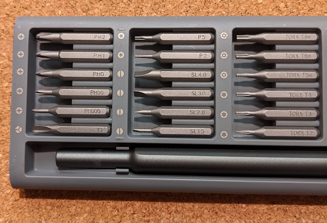
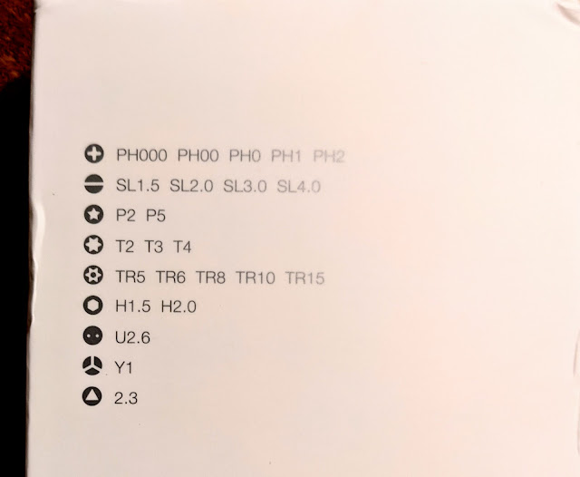

А кому прийшли ось такі няшні китайські викруточки - той я](img00.jpg)  
  
Коробочка магнітна, тримає кожну біту. Та ще і металево-пластмасова - на пластмасове ложе одягається металевий кожух-чохол.  
  
Нарешті в мене є торкс із отвором! Не треба буде більше виламувати ті нещасні піни у болтах!

  
Набір переважно мало-мікро розмірів  
  
Із декількома нетрадиційними бітами...  
  
  
Ну і звичайно, вони прийшли після того, як я [розібрав та почистив ноутбук](/posts/2020/07/30) старими викрутками...
