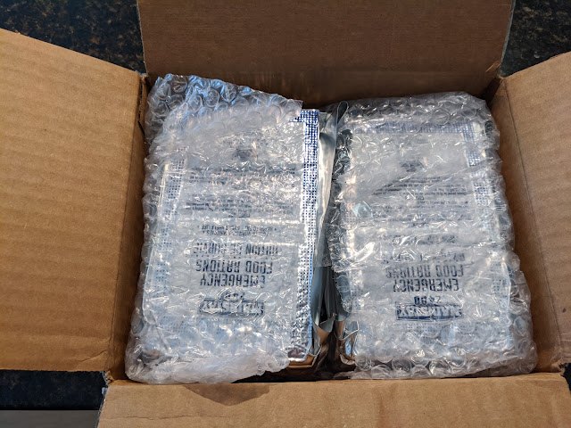
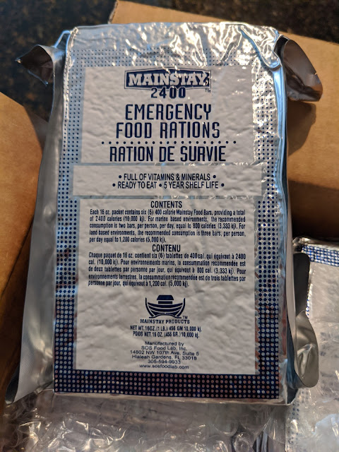
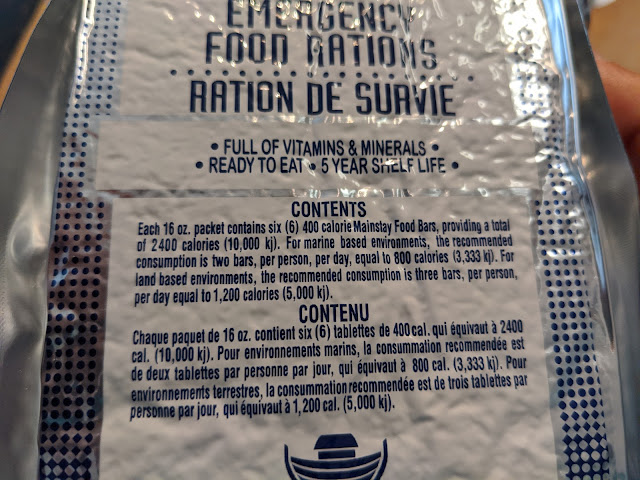
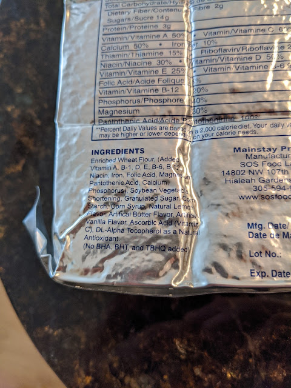
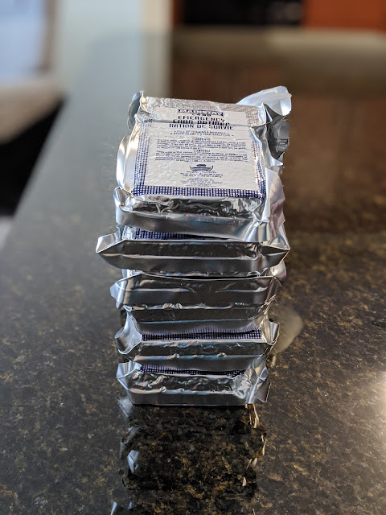

---
title: "запас 3.5\""
date: "2020-08-21T16:30:00.001Z"
categories:
    - blog
tags:
    - imported
---

 Коробка із шістьма отакими пакунками прийшла нещодавно. 

Але це не HDD, незважаючи на те, що дуже схоже і розміром, і дизайном, і вагою. Це запас їжі на випадок надзвичайної ситуації \- якісь поживні брикети, що можуть зберігатися протягом 5 років. Після нещодавнього урагану вирішив, що най буде.  
Ну і як холодильник трошки спорожніє та не буде загрози пропасти нормальним харчам \- обов'язково затестую один із тих брикетів. Пишуть, що він на двох людей на 2\-2\.5 дні. Ну буде видно, чи хоча би взагалі їстівне.  
  
  
  
  
  
  
  

