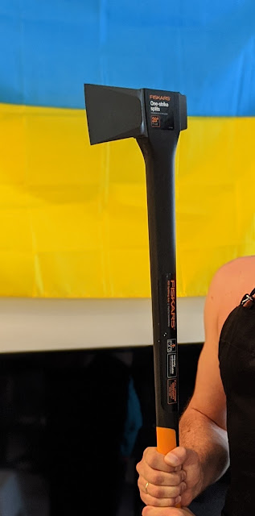
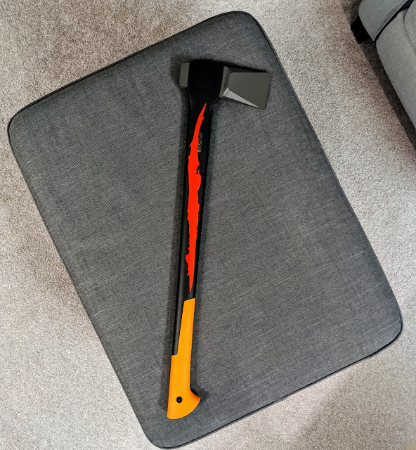

Наступним поповненням кемпінгового арсеналу став шанцевий інструмент сокира. Помахавши трошки чужою, я зрозумів що треба мати власну. І за порадою друзів (а не для того, щоб компенсувати) - вибрав подовжений варіант, Fiskars X25.
<!--more-->
  

Додаємо трошки тюнінгу, і сокира - агонь!  
  
