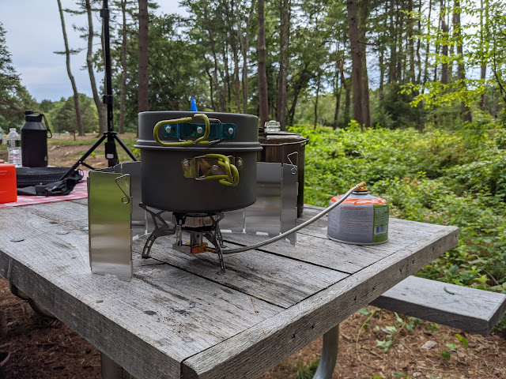
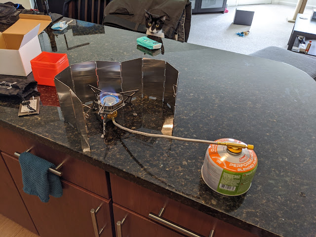

Інколи буває так, що розпалити вогнище нема де, або ніколи , ну або вже надихався димком вдосталь учора і тепер хочеться просто закип'ятити чаю.
<!--more-->
Відкриттям стало існування таких портативних компактних горілок та балонів для них. Горілки відрізняються пропускною здатністю - тобто як швидко вони спустошать балон, ну і відповідно, як швидко нагріють чайник.  Ну і трошки другорядними характеристиками - є п'єзоелемент чи немає, монтується (прикручується) на балон, чи стоїть самостійно і підключається шлангом. Балони теж є двох різних видів і діаметрів підключення, пропанові дешевші, ізопропанова суміш дорожче, але горить при -20.

Подивившись на досвід сусідів, я взяв горілку попотужніше, із великою конфоркою, і наземну - монтаж наверх балона негативно впливає на стійкість системи, тому не дуже високо - краще. Горілка під дорогі і компактні балони, але через перехідних можна підключити до дешевих. Хоча і того мінібалона з фотографії вистачило на два походи і десь зо п'ять великих чайників. Плюс компактного балона - він якраз ідеально поміщається всередину набору посуду - стає в найменшу каструльку, немовби там і має бути.Ну і вітрозахист - парканчик із серебристих металевих пластин - корисна штука, щоб тепло не витрачалося марно, а при доброму вітрі - не згасло взагалі.  

  
  
