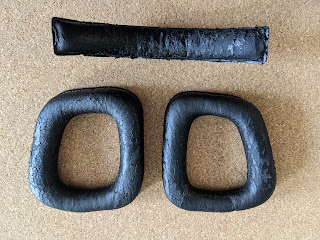
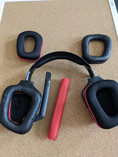
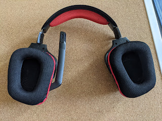

Хоча мої навушники Logitech G930 і не без зауважень - підсів акум, бува відпадає звук, нема альтернативи підключенню, окрім як через власний юсб-свисток - та всеж вони єдині, що підключилися до плойки (чомусь Соні по блютусу приставка бачити не захотіла), а ще, на відміну від тих же Соні, грають музику і голос однаково гарно - бо сонівські при дзвінку переходять в режим гарнітури і фонова музика грає, ніби по телефону.
<!--more-->
Вобщім, навушники - клас, і зручні, і хороші, і купив я їх триста років назад за смішні півціни. Тому коли в них остаточно розлізлися кожзамні амбушюри, осипаючися навколо чорними клаптиками псевдо-шкіри - в мене не повернулася рука викинути, а взявся міняти. На мій подив, офіційний сайт Лоджитеку вже не підтримує ці вуха, хоча не пройшло навіть 10 років. Але є АліЕкспрес, то ж за якихось 5 з половиною баксів я знайшов чудові тканеві замінники для побитого часом матеріалу.

Навіть інструменту ніякого не потрібно - зняв старе, одягнув-впхнув нове, попилососив, вуаля!

  
  
  
