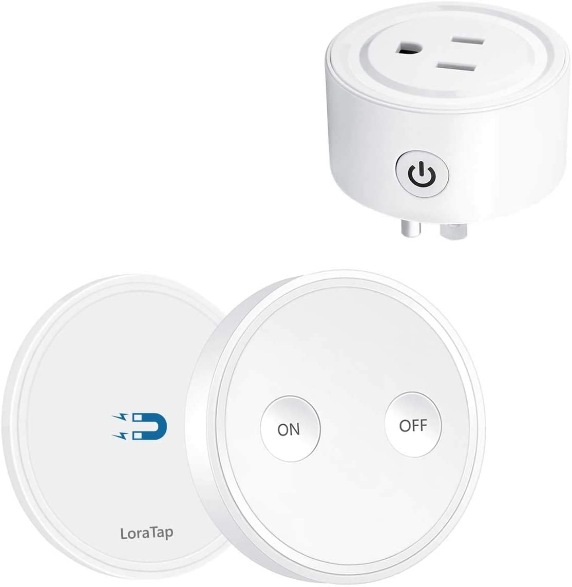

Ця історія починається в сусідському туалеті.
<!--more-->
Будучи в гостях у друзів у нашому ж апартамент-комплексі, я звернув увагу на те, наскільки тихіше працює їх витяжний вентилятор. Наш із самого початку гарчить немов старий пес, видно вже спрацювався механічно і брязкотить безупинно. У попередньому житлі на вентилятор був окремий вимикач, тому коли кортіло спокійно полежати у ванній - вентилятор можна було не вмикати, а видути зайву вологу потім, відлежавшись. Тут же тумблер єдиний і вмикає він одночасно і світло і цього хриплого монстра, тому або лежи в темряві, або в докучливому шумі.

Але це ж Америка. Тому всі проблеми в орендному житлі вирішує власник житла. Викликаю я відповідно спеціального дядечка із сервісу, написавши заявку у своєму веб-кабінеті. Приходить дідуган із стрімянкою, відкручує кришку вентилятора, відкручує ще два болти і достає той вентилятор, витягнувши його куций кабель із розетки, що прихована за решіткою.Почистив його від пиляки десь у своєму "кабінеті" і приніс назад. Включив, скрутив - деренчить точнісінько так само. Зі словами "ну так і має бути" не захотів слухати мої заперечення про те, що у сусідньому юніті такий же точно вентилятор шепоче безшумно та вшився.Поки я обмірковував, якими ж словами написати гнівно у офіс, що вентилятор вимагає заміни - розкрутив сам ту решітку і вимкнув його до біса. Прийнявши нарешті ванну в такому довгоочікуваному спокої, вирішив так і залишити на якийсь час - врешті-решт жили ми і без вентиляорів у ваннах, і нічого.  
Бо це ж Америка - і тут широко в ходу "good enough" - місцевий аналог совєцького "і так сойдьот". Вентилятор же працює. Сер, ми вас розуміємо, але нічого зробити не можемо. Ну шумить. Ну так і має бути. (про себе - не у мене ж шумить). Гуд інаф. Всього вам найкращого, сер.

Ну і я ж соціопат та інженер - і надам перевагу рішенню технічному замість соціального. Побачивши, що вентилятор там включається в звичайну американську розетку, а не розпаяний чи вткнутий через якийсь хитрий коннектор, я вирішив додати собі вимикач для вентилятора.

На сьогодні на амазоні купа розумних розеток - із програмуванням, керуванням через вай-фай, смартфон і інтернет, але мені потрібна була менш розумна, розетка-петеушниця, аби тільки до неї кнопка вкл/викл дистанційна і все. На щастя, такі теж є, хоча і з ціною на рівні середніх розумних (і дешевших за дешеві розумні).  
Тому $20 - і до мене приїхала [ось така штукенція](https://www.amazon.com/gp/product/B07GNJ36CG/ref=ppx_yo_dt_b_search_asin_title?ie=UTF8&psc=1)

Розеткова частина нагору просто так не влізла - широка і три контакти (земля), а у тій, куди її пхати, землі нема - довелося ще на алі купити куценький подовжувач із вузькими папою/мамою (і її ще трошечки підрізати, щоб земля не заважала). На щастя простору між решіткою та вентилятором повно і все помістилося.  
Пультик приклеєний над вмонтованим в стіну вмикачем світла (ну не пультик сам, а магнітна площадка, на яку пультик магнітиться), і нарешті я можу вмикати ту дзижчалку окремо, і вимикати за потреби. Розетка все ж трошки розуму має - пам'ятає свій стан, тому якщо була вимкнена - такою і залишається.

Алілуйя, нарешті стало так, як мені потрібно. Тепер не забути забрати із собою петеушницю при виїзді.
