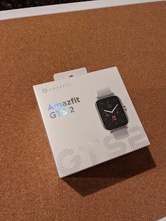
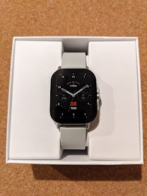
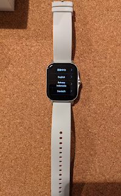

Мене досить довго цілком влаштовував Pebble Steel. Навіть після того, як компанію купили та закрили конкуренти, ентузіастами було написано і софт, і сервер із циферблатами, і все потрошку працювало. Годинник же відмінно виглядає, із металевим браслетом, звичним майже LCD-екраном і батарейкою на пару тижнів - куди там сучасним годинникам, що вимагають щоденної зарядки!
<!--more-->
Та спочатку якось відламався вібромотор (вірніше, просто проводок від нього відпав), і з батьковою допомогою його двічі перепаяли, та щось ненадовго вистачило. А власне відламувався проводок тому, що доводилося залазити всередину - кнопки переставали працювати і треба було їх чистити, аби привести до тями - отак проводок і відривав, бо ж вібродвигун приклеєно на кришку.

Мало-помалу кнопки перестали реагувати навіть після чистки, і так я носив їх іще досить довго (і носив би ще), аж поки одного разу у поїздку не взяв зарядний шнурок і годинник сів та вимкнувся. Увімкнути його вдалося, а от виставити час - вже ні. Кнопки не працюють і не збираються, синхронізація із телефоном давним-давно вимкнена за браком потреби - все одно ж не жужжить, то сенсу дарма блютусом гріти повітря...

Так я дозрів до нового годинника (а то і декількох, шопінг справа така, зупинитися важко), і перебравши варіанти - зупинився на китайському [Amazfit GTS 2](https://us.amazfit.com/pages/amazfit-gts2). Від першої версії відрізняється, насамперед, органічно прихованою головкою. Ну і металевий, 50 метрів водонепроникний, і до двох тижнів на одній зарядці, в залежності від увімкнених фіч - ясно що із регулярним пульсоміром-оксиметром-жпс-вайфай він довго не протягне.

Але ж і набор фіч суттєво за Пеббл кучерявіший - починаючи від банального крокоміра (у Пебла типу був, а насправді не працював), і до функціонування як блютус гарнітури чи, наприклад, відтворення музики прямо з годинника. Тепер подкаст можна слухати прямо у ванній прямо із зап'ястку...

Подивимося, як воно буде, що з того приживеться, а що ні. Металевий браслетик десь ще їде із АліЕкспрес.

  
  
  
